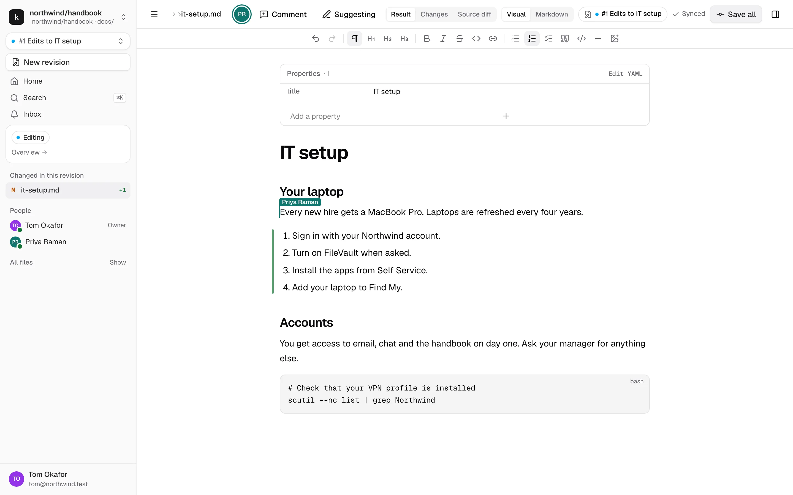

# kmdn documentation

kmdn is a collaborative editor for documentation stored as markdown in GitHub or GitLab. Anyone on the team edits pages in a familiar editor, together and live. Maintainers review each change in the same editor, and publishing merges it into the repository, credited to the people who wrote it.

## For people who write and review

Start here if someone sent you a link to kmdn.

1. [Getting started](user/getting-started.md): sign in, find your way around, what your role lets you do
2. [Read, search and give feedback](user/reading.md): pages, history, following, comments on published pages, links
3. [Edit pages in a revision](user/revisions.md): start a revision, write, work together, suggest, save
4. [Review and publish](user/review-and-publish.md): submit, review, approve, publish
5. [Updates from Published and conflicts](user/updates-and-conflicts.md): when Published changes under your revision
6. [The assistant](user/assistant.md): questions with sources, changes as suggestions, consistency findings
7. [Notifications and your profile](user/notifications-and-profile.md): inbox, browser notifications, co-author email, passkeys

## For admins

Start here to install and run kmdn.

1. [Install on Upsun](admin/install-upsun.md): the reference deployment, step by step
2. [Other installs](admin/other-installs.md): Docker, Docker Compose, the binary
3. [First run](admin/first-run.md): the setup wizard and signing in
4. [Forges and repositories](admin/repositories.md): GitHub App, GitLab, any git URL, repository settings, `.kmdn.yml`
5. [People and access](admin/people.md): users, invites, groups, roles
6. [Assistant and consistency](admin/assistant.md): AI provider, models, budgets, consistency scans
7. [Agent keys and the MCP server](admin/agent-keys.md): let external AI agents read published docs
8. [Operations](admin/operations.md): email, audit log, doctor, backups, upgrades, monitoring
9. [Configuration and CLI reference](admin/configuration.md)

## Reference

- [Glossary](reference/glossary.md): every term kmdn uses, and the git term behind it
- [Entities](reference/entities.md): what kmdn stores and how it fits together
- [How kmdn uses git](reference/git.md): branches, commits, merges, protected branches, diagrams

## The people in the examples

The screenshots come from a real kmdn running Northwind's employee handbook, a sample repository. The same people appear throughout:

| Person | Role | Does |
|---|---|---|
| Maya Chen | Instance admin, docs lead | Installs kmdn, reviews, publishes |
| Sam Lindqvist | Maintainer | Reviews |
| Tom Okafor | Contributor, people team | Updates the IT setup page |
| Priya Raman | Contributor, engineering | Joins Tom's revision |
| Luis Ortega | Viewer, new hire | Reads, asks the assistant, leaves feedback |

The screenshots are regenerated from the current build with `pnpm --filter @kmdn/e2e screenshots` after `make build`. The script lives in [`e2e/docs/`](../e2e/docs/screenshots.ts).

## Design documents

The specifications behind kmdn, with every decision and its rationale, are in [`docs/specs/`](specs/README.md).
