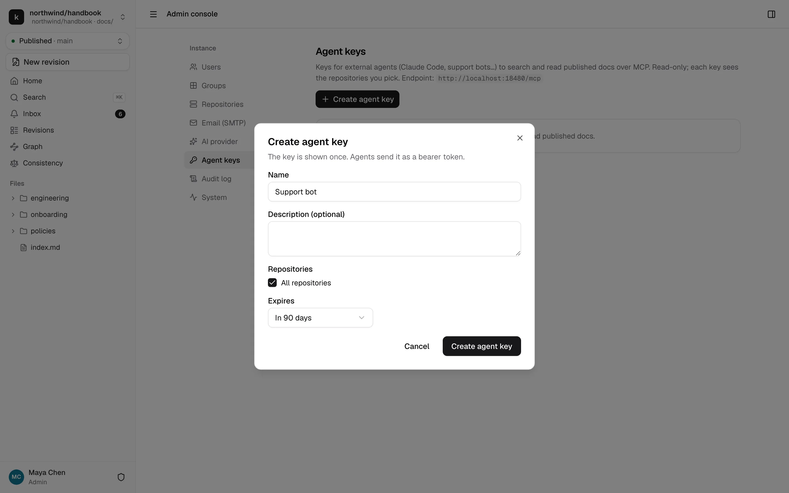
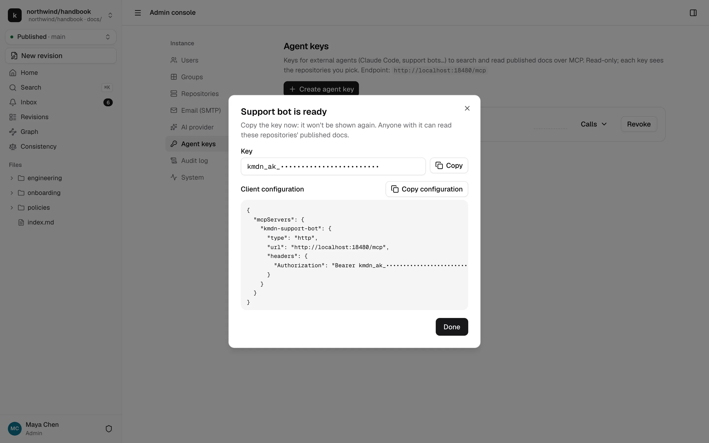
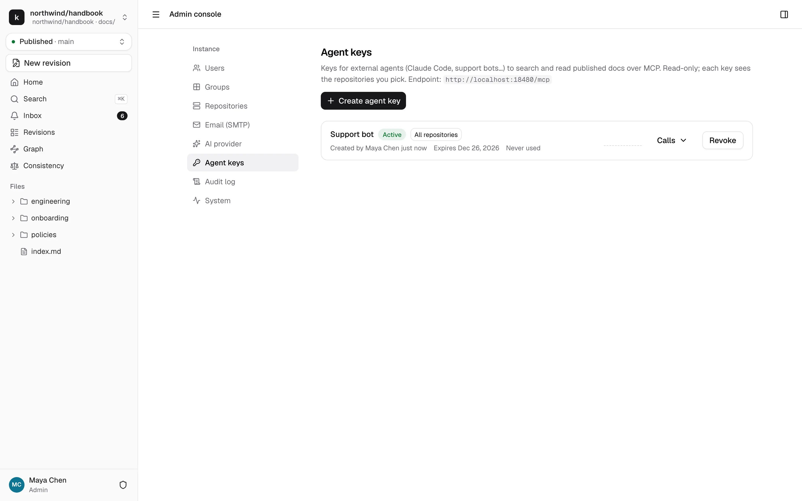

# Agent keys and the MCP server

kmdn has a read-only [Model Context Protocol](https://modelcontextprotocol.io) server at `/mcp`. External AI agents, such as Claude Code, Claude Desktop, a support bot or an internal agent, can use it to search and read your published docs. They authenticate with agent keys that instance admins create.

What an agent key can read:

- Published pages of the repositories you pick, or of every repository, including ones connected later.
- Only files under each repository's content root and globs, as in the UI.
- Page history, with authors' display names.

What it can't read: revisions, comments, feedback, checkpoints, or anything about users. It can't write anything.

## Create a key

Open Admin console → Agent keys and click **Create agent key**.



- **Name** and description, so you remember who uses it, like "Support bot".
- **Repositories**: a list, or **All repositories**.
- **Expiry**: 30, 90 or 365 days, or never. 90 days by default.

kmdn shows the key once, with a client configuration you can paste into an MCP client. Copy it now. kmdn stores only a hash and can't show it again.



```json
{
  "mcpServers": {
    "kmdn-support-bot": {
      "type": "http",
      "url": "https://docs.northwind.example/mcp",
      "headers": { "Authorization": "Bearer kmdn_ak_…" }
    }
  }
}
```

For Claude Code, the same thing from the command line:

```bash
claude mcp add --transport http kmdn https://docs.northwind.example/mcp --header "Authorization: Bearer kmdn_ak_…"
```

## Manage keys



The list shows each key's scope, who created it, when it expires, and when and from where it was last used. **Calls** opens its recent tool calls from the audit log. **Revoke** takes effect immediately. Expired and revoked keys get a 401 with a message saying so.

Each key is limited to 120 requests a minute and 10 at a time. Every tool call is in the audit log with the key, the tool, the repository and the path or query.

## What agents can do

| Tool | What it returns |
|---|---|
| `list_repos` | The repositories the key can read |
| `search` | Full-text hits with the heading, a snippet and the page's URL |
| `list_tree` | Files and folders of a repository's published content |
| `read_doc` | A page's markdown or plain text, front matter, outline, last commit and URL. Can return one section |
| `get_outline` | A page's heading tree |
| `get_history` | Published versions of a page: commit, date, title, authors |
| `read_doc_at` | A page at one of those versions |
| `get_links` | A page's outgoing links, broken ones flagged, and the pages linking to it |

Each published page is also an MCP resource, `kmdn://<owner>/<repo>/<path>`. The server offers one prompt, `answer_from_docs`, which tells the client's model to search, read and cite pages with their URLs.

The server is stateless and answers over Streamable HTTP. It checks the `Origin` header of browser clients. Keep `/mcp` reachable only by the agents that need it if your docs are sensitive: a leaked key reads every page in its scope until you revoke it.
