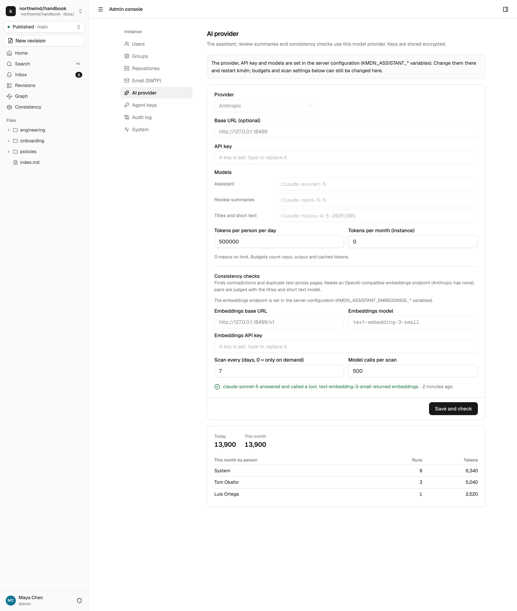

# Assistant and consistency

kmdn has a built-in assistant that runs on your server and calls an AI provider you choose. It answers questions about the repository with links to its sources, proposes edits as suggestions people accept or reject, writes review summaries, and powers the consistency check. It never publishes, approves or changes settings.

Everything here is optional. Without a provider, kmdn works the same, minus the assistant tab, review summaries and consistency findings.

## Choose a provider

| Provider | Setting | Notes |
|---|---|---|
| Anthropic | `anthropic` | The default choice. Default model `claude-sonnet-5`. No embeddings API, so the consistency check needs a separate embeddings endpoint. |
| OpenAI | `openai` | Uses the Responses API on `api.openai.com`. |
| OpenAI-compatible servers | `openai` plus a base URL | OpenRouter, Ollama, vLLM, LM Studio, or a company gateway. The model must support tool calling. |

A local model through Ollama or vLLM keeps repository content inside your network.

## Where to set it

**From the environment.** On Upsun, set `KMDN_ASSISTANT_PROVIDER`, `KMDN_ASSISTANT_API_KEY` and the other `KMDN_ASSISTANT_*` variables, as [Install on Upsun](install-upsun.md#3-set-the-assistant-variables) shows. kmdn checks the provider at startup. The admin console then shows the provider, key, base URL and models as locked, and you can still change budgets and scan settings there.

**From the admin console.** Without those variables, open Admin console → AI provider, fill in the provider, key and models, and click **Save and check**. kmdn stores the key encrypted.

Either way, the check makes one small call to confirm the model answers and can call a tool, and one to the embeddings endpoint if it's set. The result shows under the form. If the provider refuses the key, the assistant turns off until the next restart or the next **Save and check**.

## Models

kmdn uses three model slots, so you can put a cheaper model on the small jobs:

| Slot | Variable | Used for |
|---|---|---|
| Assistant | `KMDN_ASSISTANT_MODEL` | Answering questions, editing revisions |
| Review summaries | `KMDN_ASSISTANT_REVIEW_MODEL` | The summary and checks reviewers see |
| Titles and short text | `KMDN_ASSISTANT_SHORT_MODEL` | Summaries for readers, suggested titles, consistency judgments |

Empty slots use the provider's defaults.

## Budgets

- **Tokens per person per day.** 500,000 by default. A person who reaches it gets an error from the assistant until the next day.
- **Tokens per month for the instance.** 0 means no limit.

Budgets count input, output and cached tokens. Below the form, the page shows usage today and this month, by person. "System" is kmdn's own work: review summaries, summaries for readers and consistency scans.

## What leaves your server

The assistant sends the provider only what it needs for the current request: the question, the system prompt, and what its tools return, such as the pages it searched and read. kmdn doesn't send the whole repository in the background.

The consistency check sends passages of published pages to the embeddings endpoint, and pairs of similar passages to the short-text model.

Every assistant run is in the [audit log](operations.md#audit-log) with the person, the repository, the tools called and the tokens used.

## Consistency check

The consistency check finds places where the repository contradicts itself or repeats itself. One page says "30 working days abroad", another says "20": that's a contradiction. It needs an embeddings endpoint:

| Variable | Example |
|---|---|
| `KMDN_ASSISTANT_EMBEDDINGS_MODEL` | `text-embedding-3-small` |
| `KMDN_ASSISTANT_EMBEDDINGS_API_KEY` | An OpenAI key |
| `KMDN_ASSISTANT_EMBEDDINGS_BASE_URL` | Empty for OpenAI, or another OpenAI-compatible endpoint |

How it works:

1. kmdn splits published pages into passages, one per heading section, and stores an embedding for each. It only re-embeds passages that changed.
2. It pairs each passage with the most similar passages elsewhere in the repository.
3. The short-text model judges each pair: contradiction, duplicate, related, or unrelated. Verdicts are cached per pair, so later checks only pay for new pairs.

It runs in two places:

- **On each revision**, for the passages the revision changes, a short while after edits and when it's submitted. Findings show in the revision overview, in the Publish dialog and as underlines in the editor.
- **As a repository scan**, every 7 days by default, or when a maintainer clicks **Run now** on the Consistency page. Set the interval and the cap on model calls per scan in Admin console → AI provider. A scan that hits the cap continues where it stopped on the next run.

Findings are advisory. They never block submitting, approving or publishing.

## Turning it off

Unset `KMDN_ASSISTANT_PROVIDER`, or clear the provider in the admin console, and restart. To keep the assistant but stop consistency checks, remove the embeddings model.
