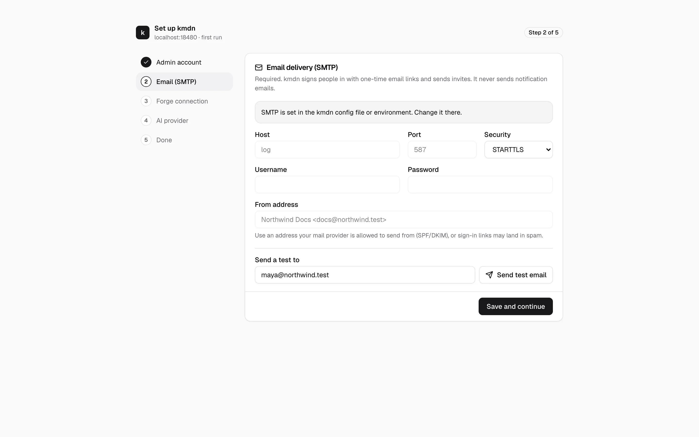
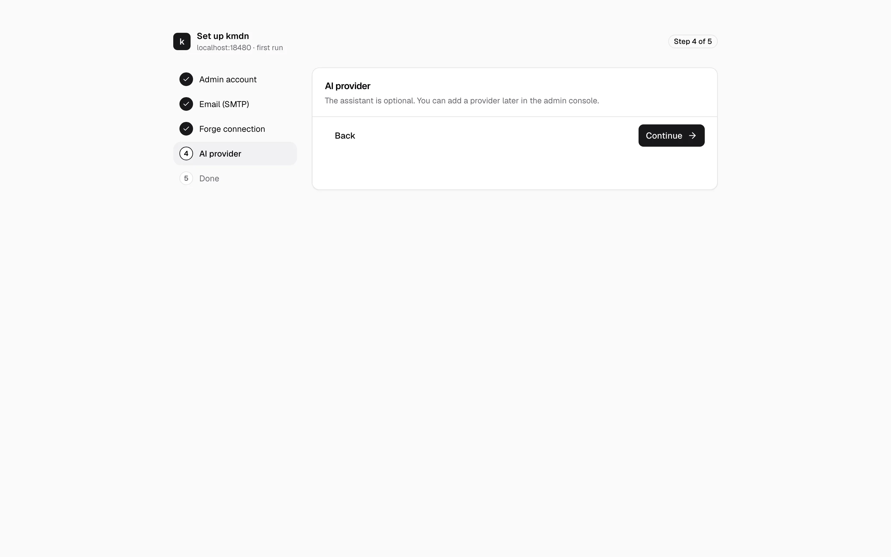
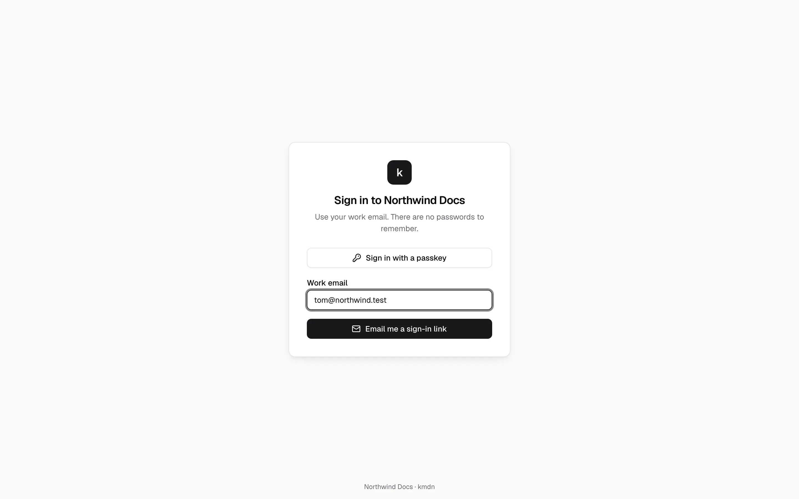
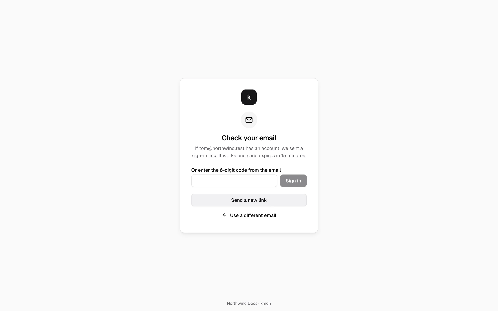

# First run

A new kmdn has no users. Until someone creates the first admin, it serves a setup wizard protected by a one-time token, so nobody who finds the URL first can claim the instance.

## Open the setup link

kmdn prints the link in its log while no admin exists. The token changes every time kmdn restarts, until setup is done.

- On Upsun: `upsun log app | grep "needs setup"`
- With Docker: `docker logs <container> 2>&1 | grep "needs setup"`
- With the binary: look for the `kmdn needs setup` line in the server's output

Opening the plain `/setup` page without the token only tells you to use the link from the log.

## The wizard

The wizard has five steps. Only the first two are required.

### 1. Admin account

Enter your name and an email address you can receive mail at. You'll sign in with email links, not a password. The instance name shows on the sign-in page and in emails, for example "Northwind Docs".

**Create admin account** signs you in.

### 2. Email (SMTP)

kmdn sends two kinds of email: sign-in links and invites. It never sends notification emails.

If the environment already sets SMTP, as Upsun's mail relay does, the form is locked and says where to change it. Otherwise enter your provider's host, port, security, username, password and from address, and send a test email to yourself. Setup can't finish without working email.

Use a from address your provider is allowed to send from, with SPF and DKIM in place. Otherwise sign-in links may land in spam.

### 3. Forge connection

This step points you to the admin console, where you'll connect GitHub, GitLab or a plain git URL once the wizard is done. Click **Continue**.

### 4. AI provider

The assistant is optional. When `KMDN_ASSISTANT_*` variables set the provider, this step shows it as configured. Otherwise continue, and add a provider later in Admin console → AI provider. See [Assistant and consistency](assistant.md).

### 5. Done

**Open kmdn** takes you to the app. It's empty until you connect a repository.

## Signing in afterwards

People sign in at `/signin` with their work email. kmdn emails a link, valid for 15 minutes and usable once, plus a 6-digit code for when the link opens on another device.

After their first sign-in, people can add a passkey from their profile and sign in with one tap. If an admin set up GitHub or GitLab sign-in, **Continue with GitHub** or **Continue with GitLab** works for anyone whose forge account is linked, or whose verified forge email matches their kmdn email. Forge sign-in never creates an account by itself.

## Next steps

1. [Connect GitHub or GitLab and your first repository](repositories.md).
2. [Invite people and give them roles](people.md).
3. Try a change yourself: open a page, type, and follow the [user guide](../user/revisions.md).
