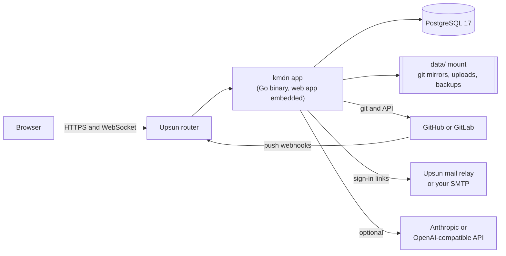
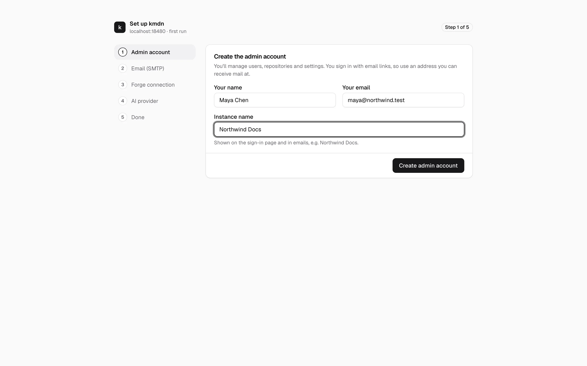

# Install kmdn on Upsun

This guide deploys kmdn on [Upsun](https://upsun.com), the reference deployment. The repository already contains everything Upsun needs. You create a project, set two variables for the assistant, push, and open the setup link. Plan on about twenty minutes, most of it waiting for the first build.

If you'd rather run kmdn on your own server, see [Other installs](other-installs.md).

## What you get



- `.upsun/config.yaml` defines one application, `kmdn`, built from the repository root with Go 1.26, Node 24, pnpm and git. The build compiles the web app, embeds it in the binary and produces `bin/kmdn`.
- A PostgreSQL 17 service, `db`, holds users, revisions, comments and settings.
- A storage mount, `data/`, holds the git mirrors of your connected repositories, uploaded images and local backups.
- The start command is `deploy/upsun/kmdn serve`. That script reads the route, the database and the mail relay Upsun provides, and turns them into kmdn settings. You don't write a config file.
- The route disables caching, and the app disables request buffering. Live editing runs over a WebSocket, and both would break it.

## Before you start

You need:

- An Upsun account and the [Upsun CLI](https://docs.upsun.com/administration/cli.html), logged in with `upsun login`.
- git 2.40 or newer on your machine.
- An API key for the assistant, if you want it: Anthropic, OpenAI, or any OpenAI-compatible server. kmdn works without one.
- Admin rights on the GitHub organization or GitLab group whose repositories you'll connect. You can do that part after the install.

Decide on the domain now if you want your own, like `docs.northwind.example`. The GitHub App kmdn creates for you records the instance's URL, and passkeys are tied to its host name. Adding the domain before those steps saves you from redoing them.

## 1. Get the code

Clone kmdn. A fork works too, and makes it easier to track your own changes:

```bash
git clone https://github.com/kmdn-app/kmdn.git
```

```bash
cd kmdn
```

## 2. Create the Upsun project

```bash
upsun project:create --title kmdn --default-branch main --set-remote
```

The CLI asks for an organization and a region, then adds a git remote named `upsun` to your clone. The `main` environment becomes production.

If the project already exists, link the clone to it instead:

```bash
upsun project:set-remote <project-id>
```

## 3. Set the assistant variables

The assistant and the consistency check need an AI provider. On Upsun, set it with project variables, before the first deploy. Create the key first. A provider without a key fails kmdn's config check, and the app won't start.

```bash
upsun variable:create --level project --name env:KMDN_ASSISTANT_API_KEY --sensitive true --value 'sk-ant-…'
```

```bash
upsun variable:create --level project --name env:KMDN_ASSISTANT_PROVIDER --value anthropic
```

For OpenAI, use `openai` as the provider. For another OpenAI-compatible server, such as OpenRouter, Ollama, vLLM or a company gateway, also set `KMDN_ASSISTANT_BASE_URL`.

Anthropic has no embeddings API, and the consistency check needs one. To turn the check on with an Anthropic assistant, add an OpenAI-compatible embeddings endpoint:

```bash
upsun variable:create --level project --name env:KMDN_ASSISTANT_EMBEDDINGS_MODEL --value text-embedding-3-small
```

```bash
upsun variable:create --level project --name env:KMDN_ASSISTANT_EMBEDDINGS_API_KEY --sensitive true --value 'sk-…'
```

Skip this whole step to run without the assistant. You can add the variables later and redeploy. [Assistant and consistency](assistant.md) lists every model setting.

## 4. Push

```bash
git push upsun main
```

The first build takes a few minutes: it installs the JavaScript dependencies, builds the web app and compiles Go. The last build line prints the kmdn version.

## 5. Give it enough room

Upsun starts new apps with small resources. kmdn keeps a git mirror of every connected repository on the `data/` mount, and `kmdn doctor` warns when less than 1 GB is free. Check what the environment has, then raise it:

```bash
upsun resources:get
```

```bash
upsun resources:set --size kmdn:1 --disk kmdn:2048,db:1024
```

A 1 CPU app with 2 GB of disk is comfortable for a team of a few dozen people and repositories of normal size. Resources are billed, so size them to your repositories. Larger repositories need more disk, and more simultaneous editors need more CPU.

## 6. Add your domain

Skip this if the Upsun URL is fine.

```bash
upsun domain:add docs.northwind.example
```

Point the domain's DNS at the target the CLI prints, and wait for the certificate. kmdn's base URL is the environment's primary route, so kmdn picks up the domain on the next restart. Sign-in links, webhooks and OAuth callbacks then use it.

## 7. Create the first admin

kmdn prints a one-time setup link in its log while no admin exists. Find it:

```bash
upsun log app | grep "needs setup"
```

The line holds a URL like `https://docs.northwind.example/setup?token=…`. The token changes every time the app restarts until setup is done, so use the newest line.

Open it and follow the wizard. [First run](first-run.md) explains each step. On Upsun, email is already set up through the platform's mail relay, and the AI provider shows as set by the environment.



## 8. Check the install

```bash
upsun ssh -- deploy/upsun/kmdn doctor
```

Doctor checks git, free space on the mount, the database and pending migrations, the secret key, SMTP, each forge and the AI provider. It exits with an error when a check fails. The same checks are in Admin console → System.

Then [connect a repository](repositories.md) and [invite your team](people.md).

## Settings Upsun provides

`deploy/upsun/kmdn` sets these before starting kmdn. A variable you set yourself as `env:KMDN_…` wins over the derived value.

| kmdn setting | Where it comes from |
|---|---|
| `KMDN_SERVER_BASE_URL` | The environment's primary route |
| `KMDN_SERVER_LISTEN` | `:$PORT` |
| `KMDN_DB_URL` | The `database` relationship |
| `KMDN_DATA_DIR` | The `data/` mount |
| `KMDN_SECRET_KEY` | A SHA-256 of `PLATFORM_PROJECT_ENTROPY`, stable for the project's life |
| `KMDN_SMTP_HOST`, `_PORT`, `_SECURITY`, `_FROM` | Upsun's mail relay, sending from `kmdn@<your host>`. Only on environments with outgoing email, which is production by default |
| `KMDN_SERVER_TRUSTED_PROXIES` | Everything, since only the Upsun router reaches the app |
| `KMDN_TELEMETRY_METRICS` | `false`. Set it to `true` along with `KMDN_TELEMETRY_METRICS_TOKEN` to expose `/metrics` |

Settings that come from variables show as locked in the admin console.

## Variables you can set

Upsun applies variable changes on the next deploy. Without a code change, run `upsun redeploy`.

| Variable | Default | What it does |
|---|---|---|
| `KMDN_ASSISTANT_PROVIDER` | none | `anthropic` or `openai`. Empty leaves the assistant off. |
| `KMDN_ASSISTANT_API_KEY` | none | The provider's API key. Mark it sensitive. |
| `KMDN_ASSISTANT_BASE_URL` | The provider's API | For OpenAI-compatible servers and gateways. |
| `KMDN_ASSISTANT_MODEL` | `claude-sonnet-5` on Anthropic | The model that answers questions and edits. |
| `KMDN_ASSISTANT_REVIEW_MODEL` | The provider's default | Writes review summaries. |
| `KMDN_ASSISTANT_SHORT_MODEL` | The provider's default | Titles, summaries for readers, consistency judgments. |
| `KMDN_ASSISTANT_EMBEDDINGS_MODEL` | none | Turns the consistency check on, e.g. `text-embedding-3-small`. |
| `KMDN_ASSISTANT_EMBEDDINGS_API_KEY` | none | Key for the embeddings endpoint. |
| `KMDN_ASSISTANT_EMBEDDINGS_BASE_URL` | `https://api.openai.com/v1` | Another OpenAI-compatible embeddings endpoint. |
| `KMDN_SMTP_HOST`, `_PORT`, `_USERNAME`, `_PASSWORD`, `_FROM` | The mail relay | Your own SMTP server. |
| `KMDN_SMTP_SECURITY` | `starttls` | `tls` for port 465, `none` for a local relay. |
| `KMDN_AUTH_AUTO_JOIN_DOMAINS` | none | Comma-separated email domains whose people can create an account without an invite. |
| `KMDN_SECRET_KEY` | Derived | Set it to manage the key yourself. See [the secret key](#the-secret-key). |

The [configuration reference](configuration.md) lists every setting.

### Your own SMTP server

The relay sends from `kmdn@<your host>`, which some mail providers treat as spam. Your own provider with SPF and DKIM set up is more reliable:

```bash
upsun variable:create --level project --name env:KMDN_SMTP_HOST --value smtp.example.com
upsun variable:create --level project --name env:KMDN_SMTP_PORT --value 587
upsun variable:create --level project --name env:KMDN_SMTP_USERNAME --value kmdn
upsun variable:create --level project --name env:KMDN_SMTP_PASSWORD --sensitive true --value '…'
upsun variable:create --level project --name env:KMDN_SMTP_FROM --value 'Northwind Docs <docs@northwind.example>'
```

## The secret key

kmdn encrypts stored credentials with its secret key: the GitHub App's private key, GitLab tokens, webhook secrets, the SMTP password, AI keys. On Upsun the key is derived from the project's entropy, so it stays the same across deploys and environments, and you never handle it.

It only matters when you move data to another project, for example when restoring a backup elsewhere. The new project has a different entropy, so it can't decrypt the old credentials. Before a move, read the current key and keep it in your password manager:

```bash
upsun ssh -- 'printf %s "kmdn-secret-key:$PLATFORM_PROJECT_ENTROPY" | openssl dgst -sha256 -binary | base64'
```

Then set it as a sensitive `env:KMDN_SECRET_KEY` variable on the new project.

To rotate the key, generate a new one with `head -c32 /dev/urandom | base64`, re-encrypt the stored credentials with it, then make it the app's key:

```bash
upsun ssh -- deploy/upsun/kmdn admin rotate-secret-key -new '<new key>'
```

```bash
upsun variable:create --level project --name env:KMDN_SECRET_KEY --sensitive true --value '<new key>'
```

The variable triggers a redeploy. Until it finishes, the running app can't decrypt the re-encrypted credentials, so rotate at a quiet time.

If the key is lost, kmdn still starts, but people have to re-enter the forge, SMTP and AI credentials. Doctor names the secrets it can't decrypt.

## Upgrading

Pull the new version into your clone and push it:

```bash
git pull origin main
```

```bash
git push upsun main
```

Database migrations run when kmdn starts. They only go forward, so take a backup before a major upgrade. To see what a new version will apply, run `deploy/upsun/kmdn migrate status` over SSH.

## Backups

Upsun backups cover both the database and the `data/` mount:

```bash
upsun backup:create
```

kmdn's own backup bundles uploads and the config into one archive. On Upsun the database is PostgreSQL, so leave it to Upsun and skip it in kmdn's archive:

```bash
upsun ssh -- deploy/upsun/kmdn backup --skip-db --out data/backups/kmdn.tar.zst
```

Git mirrors aren't in either archive on purpose. kmdn clones them again after a restore. [Operations](operations.md#backups-and-restore) covers restores.

## Preview environments

An Upsun branch environment starts with a copy of its parent's database and mount. A kmdn running there has production's forge credentials and the same secret key, so it can push branches and merge pull requests in your real repositories. Use preview environments to try an upgrade, and delete them when you're done. Preview environments have no outgoing email unless you turn it on with `upsun environment:info enable_smtp true`.

## Troubleshooting

**The setup link says the token is invalid.** The app restarted and printed a new one. Run the log command again and use the newest line.

**Sign-in emails don't arrive.** Check the environment has outgoing email, which production has by default, then look for SMTP errors with `upsun log app | grep -i smtp`. Admin console → Email (SMTP) has a test button. Relay mail from `kmdn@<your host>` can land in spam, and your own SMTP server fixes that.

**The editor says "Reconnecting…" all the time.** Something between the browser and kmdn buffers or caches the WebSocket. The shipped `.upsun/config.yaml` turns both off. Check you didn't add a CDN or a route cache in front of it.

**The app doesn't start after setting the assistant variables.** `KMDN_ASSISTANT_PROVIDER` is set without `KMDN_ASSISTANT_API_KEY`. Add the key and redeploy.

**Doctor warns about disk space.** Raise the app's disk with `upsun resources:set --disk kmdn:<MB>`.
