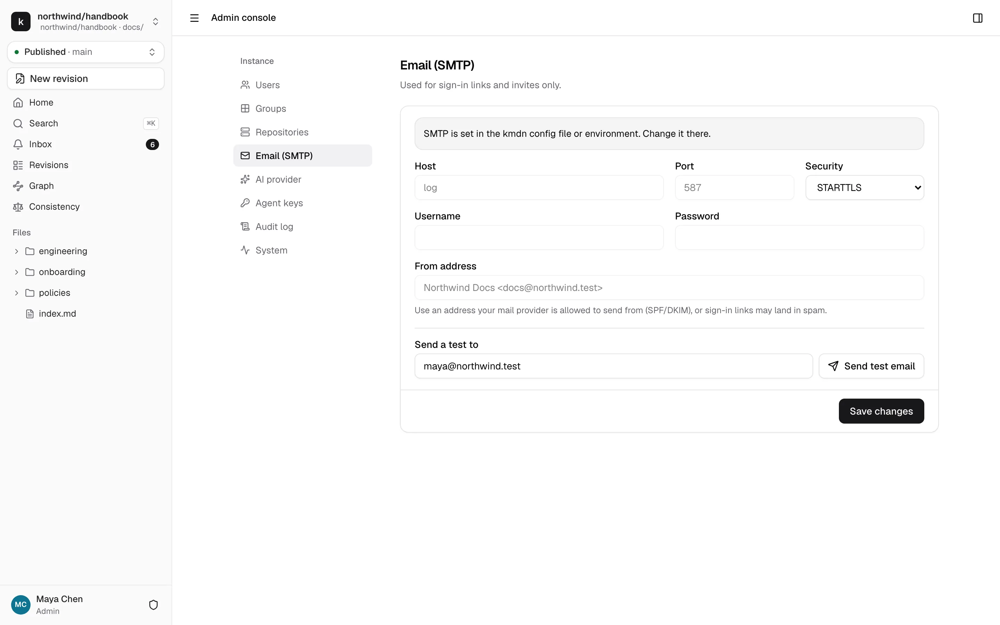
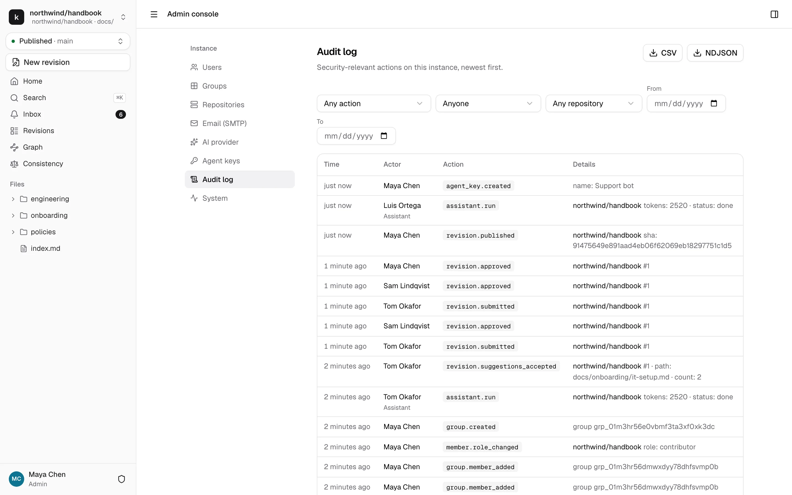
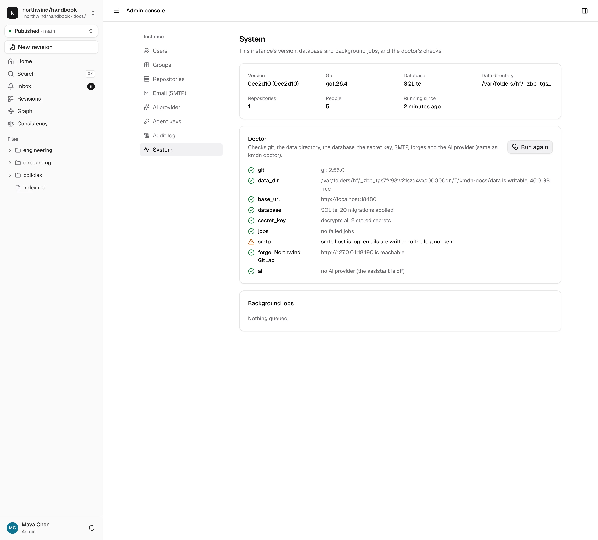

# Operations

Day-to-day care of a kmdn instance: email, the audit log, health checks, backups, upgrades and monitoring. On Upsun, run the `kmdn` commands below as `upsun ssh -- deploy/upsun/kmdn <command>` so they get the platform's settings.

## Email

Admin console → Email (SMTP) shows the mail settings and sends a test message. kmdn sends only sign-in links and invites. Notifications stay inside kmdn.



When SMTP comes from the configuration or environment variables, as with Upsun's relay, the form is read-only and says so. Change it where it's set.

If people report missing sign-in emails, send a test from this page first. Then check the from address. Your mail provider must be allowed to send for its domain with SPF and DKIM, or links land in spam.

## Audit log

Admin console → Audit log lists security-relevant actions, newest first. Filter by action, by actor, by repository and by date. An actor is a person, an agent key, the assistant or the system. **Details** shows the full entry. The download buttons export the filtered list as CSV or NDJSON.



kmdn records, among others:

- Sign-ins, with the method and whether they succeeded, and revoked sessions
- Invites, role changes, admin changes, deactivations, group changes
- Repositories connected, changed or disconnected
- Revisions submitted, approved, sent back, published, closed
- Assistant runs, with the tools called and the tokens used
- Agent keys created, revoked, and every tool call they make
- Secrets changed. The entry says which secret, never its value
- Setup completed

The log is append-only. Nobody can edit or delete entries from the UI.

## System and doctor

Admin console → System shows the version, the database, the data directory, how many repositories and people the instance has, and how long it has been running.



**Run checks** runs the doctor, the same checks as `kmdn doctor`:

- git is 2.40 or newer
- The data directory is writable, with a warning under 1 GB free
- The base URL is HTTPS, unless it's local
- The database answers and no migration is pending
- The secret key decrypts every stored secret, naming the kinds that fail
- No background jobs have failed
- SMTP is reachable, each forge's API answers, and the AI provider passed its last check

From the command line, `kmdn doctor -offline` skips the network checks. The command exits with an error when a check fails, so it fits in a health script.

**Background jobs** lists queued, running and failed jobs: fetching repositories, pushing revision branches, publishing, sending webhooks, consistency scans. A failed job shows its error and attempts, and **Retry** queues it again.

## Backups and restore

kmdn's state is in two places: the database, and the data directory's uploads. Git mirrors are a cache that kmdn rebuilds from the forge.

### Back up

```bash
kmdn backup -out kmdn.tar.zst
```

With SQLite, this is safe while kmdn runs: it takes a consistent copy of the database, then adds uploads and the config file. The archive starts with a manifest that records kmdn's version and schema version. The config copy has the secret key and passwords blanked unless you add `-include-secrets`. Git mirrors are left out.

With PostgreSQL, back up the database with `pg_dump`, or with Upsun's own backups, and add `-skip-db`:

```bash
kmdn backup -skip-db -out kmdn.tar.zst
```

Keep the secret key somewhere other than the backups. A backup without the key restores everything except stored credentials.

### Restore

Stop kmdn first, then:

```bash
kmdn restore -in kmdn.tar.zst
```

Restore refuses while a server answers on kmdn's listen address, and refuses to replace an existing database unless you add `-force`. It restores the database and uploads, and writes the backed-up config to `<data dir>/kmdn.yaml.restored` so it never overwrites your live config. It deletes the mirrors and queues a sync of every repository, so kmdn clones them again when it starts.

On Upsun, restore an Upsun backup with `upsun backup:restore`. It brings back both the database and the mount.

## Upgrades

kmdn follows semantic versioning. Database migrations run automatically when kmdn starts, holding a lock so two processes don't race. They only go forward: take a backup before upgrading, and read the release notes.

```bash
kmdn migrate status
```

lists applied and pending migrations. `kmdn migrate up` applies them without starting the server.

On Upsun, an upgrade is `git pull` from the kmdn repository and `git push upsun main`. See [Install on Upsun](install-upsun.md#upgrading).

## The secret key

The secret key encrypts every stored credential: the GitHub App's private key, GitLab tokens, OAuth secrets, webhook secrets, the SMTP password and AI keys. Each secret has its own data key, encrypted by the secret key, so rotation re-encrypts data keys without touching the rest.

To rotate:

```bash
kmdn admin rotate-secret-key -new "$(head -c32 /dev/urandom | base64)"
```

Then put the new key in the configuration and restart. On Upsun, the key is derived from the project, see [the secret key on Upsun](install-upsun.md#the-secret-key).

If the key is lost, kmdn starts but can't decrypt the stored credentials. Doctor lists which ones. Re-enter them in the admin console.

## Monitoring

### Health endpoints

- `/healthz` answers when the process is up.
- `/readyz` answers when the database works, the data directory is writable and the document engine is warmed up.

### Metrics

`/metrics` serves Prometheus metrics when `telemetry.metrics` is on. It's off by default on Upsun, where the endpoint would be public. To turn it on safely, set a token and scrape with `Authorization: Bearer <token>`:

```bash
upsun variable:create --level project --name env:KMDN_TELEMETRY_METRICS --value true
upsun variable:create --level project --name env:KMDN_TELEMETRY_METRICS_TOKEN --sensitive true --value '…'
```

Elsewhere, without a token, keep `/metrics` off the internet with a proxy rule or a firewall. The shipped Caddyfile hides it.

Useful series:

| Metric | Watch for |
|---|---|
| `kmdn_http_requests_total`, `kmdn_http_request_duration_seconds` | Error rates and slow routes |
| `kmdn_websocket_connections`, `kmdn_active_rooms` | How many people are editing |
| `kmdn_jobs_queued`, `kmdn_jobs_failed` | A growing queue or failing jobs |
| `kmdn_git_command_duration_seconds` | Slow fetches from the forge |
| `kmdn_forge_request_duration_seconds` | Forge API latency and error codes |
| `kmdn_publish_total` | Publish outcomes |
| `kmdn_llm_tokens_total`, `kmdn_llm_call_duration_seconds` | AI spend and latency by model |
| `kmdn_mcp_calls_total` | Agent key usage by tool |

### Logs and traces

kmdn logs JSON lines by default, with a request ID and, where they apply, the user, repository and revision. On Upsun, read them with `upsun log app`.

To send OpenTelemetry traces, set `telemetry.otlp_endpoint` to a collector's base URL, like `http://otel-collector:4318`. kmdn traces HTTP requests, jobs, git commands, forge API calls and AI calls. It never sends trace context to forges.

## Capacity

kmdn is one process on one node. On a laptop, 50 people editing the same page see each other's changes in under 10 ms at the 99th percentile, using about a tenth of a CPU core. 500 open revisions keep the revision list under 15 ms. A single page accepts up to 50 editors at once.
