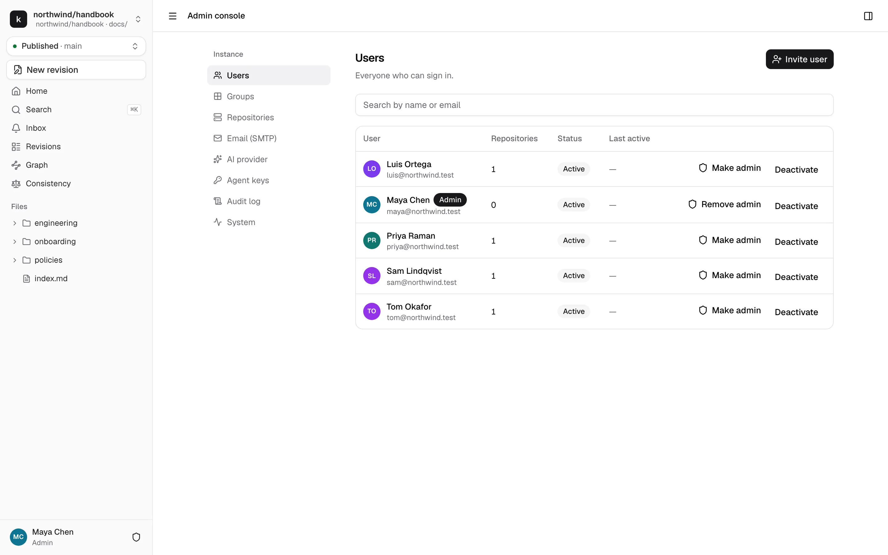
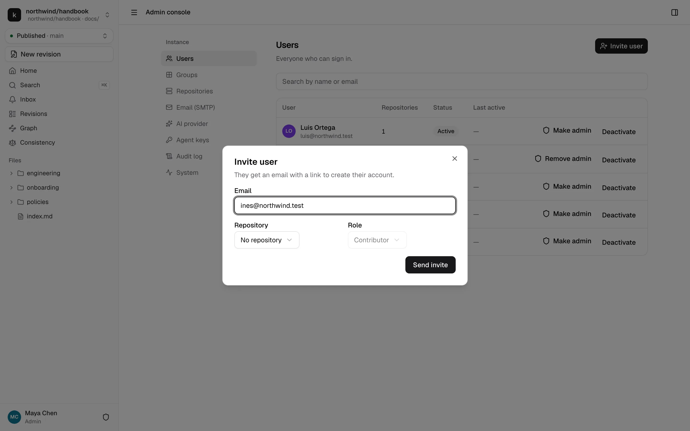
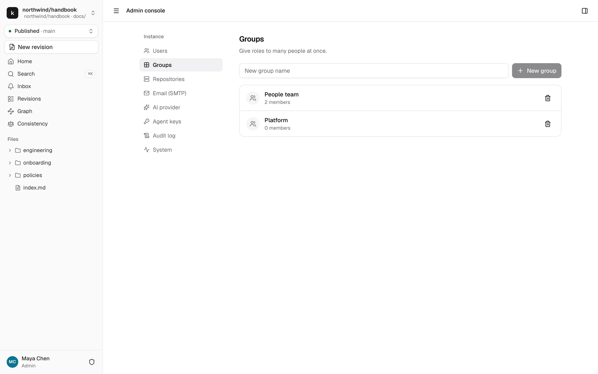

# People and access

Everyone in kmdn belongs to the instance. What they can do depends on their role in each repository. Roles are managed in kmdn, and permissions on GitHub or GitLab aren't used.

## Users

Admin console → Users lists everyone who can sign in, how many repositories they can reach, their status and when they were last active.

From this list, an instance admin can:

- **Invite user.** Sends an email with a link to create an account, optionally with a role on one repository.
- **Make admin** or **Remove admin.** Instance admins are Admin on every repository and can open the admin console.
- **Deactivate** or **Reactivate.** A deactivated person can't sign in, and their open sessions stop working. Their past work and credits stay.

### How people join

kmdn has no open sign-up. People join by:

- **An invite** from an instance admin, or from a repository admin in that repository's Members settings.
- **Auto-join by email domain.** If the configuration lists domains in `auth.auto_join_domains`, anyone with a verified address in those domains can sign in and get an account. They see no repository until someone gives them a role. On Upsun, set the domains as a comma-separated `KMDN_AUTH_AUTO_JOIN_DOMAINS` variable.

The first admin comes from the setup wizard. There are no passwords to reset. Anyone who can read their email can sign in.

## Groups

Admin console → Groups holds named sets of people, like "People team" or "Platform". A group can hold a role on any repository, and each member gets it. That's easier than managing roles person by person when a team changes.

Type a name and click **New group**, then open it to add people. Grant the group a role from a repository's **Members and groups** settings. Groups don't nest, and kmdn doesn't sync them from an identity provider.

## Roles

Each repository gives a user a role, directly or through groups. When several apply, the highest wins.

| What they can do | Viewer | Contributor | Maintainer | Admin |
|---|:-:|:-:|:-:|:-:|
| Read published pages, search, history, blame | ✓ | ✓ | ✓ | ✓ |
| Ask the assistant about the repository | ✓ | ✓ | ✓ | ✓ |
| Comment on published pages and in revisions | ✓ | ✓ | ✓ | ✓ |
| Follow pages and folders | ✓ | ✓ | ✓ | ✓ |
| Start revisions, edit the ones they're invited to, add editors to their own | | ✓ | ✓ | ✓ |
| Prompt the assistant and accept or reject suggestions in revisions they can edit | | ✓ | ✓ | ✓ |
| Edit any revision in Editing, review, approve, publish, close any revision | | | ✓ | ✓ |
| Run the consistency scan, ignore findings | | | ✓ | ✓ |
| Repository settings, members, webhooks, disconnect | | | | ✓ |

Instance admins have Admin on every repository.

### Rights inside a revision

The role sets the ceiling. The revision's state narrows it, so reviewers have a stable target while they review:

| | Editing | In review | Approved |
|---|---|---|---|
| The revision's editors | Edit, suggest, comment, submit | Read-only. Comment, accept or reject reviewers' suggestions, withdraw | Read-only. Comment |
| Assigned reviewers | Comment | Edit directly, suggest, comment, approve, request changes | Edit, which resets approvals. Publish |
| Other maintainers | Edit | Comment | Comment, publish |
| Everyone else in the repository | View, comment | View, comment | View, comment |

A revision's editors are the person who started it plus the people they added. Editors must be Contributors or above.

## Sessions and devices

Sessions last 30 days and renew as people use kmdn. Change the length with `auth.session_ttl`. People see their signed-in devices in their profile and can sign out of any of them. Deactivating someone cuts off all their sessions.

## Audit trail

Sign-ins, invites, role changes, admin changes and deactivations all land in the [audit log](operations.md#audit-log).
