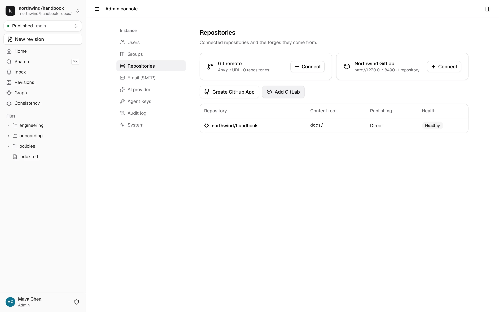
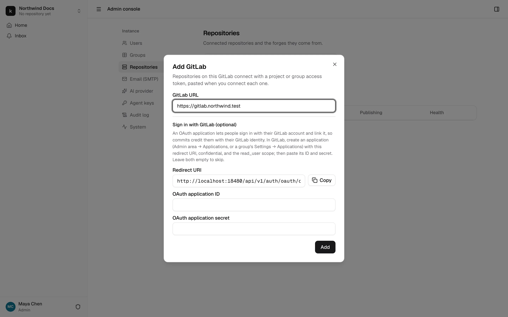
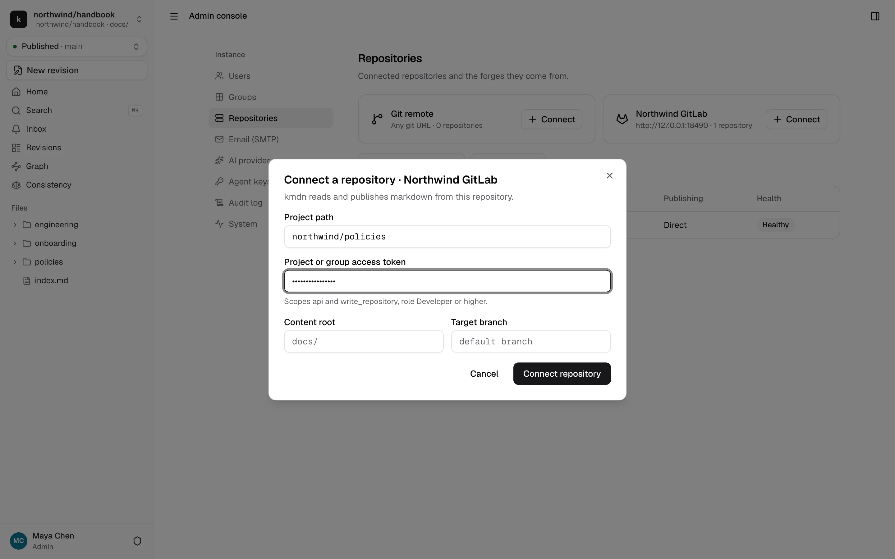
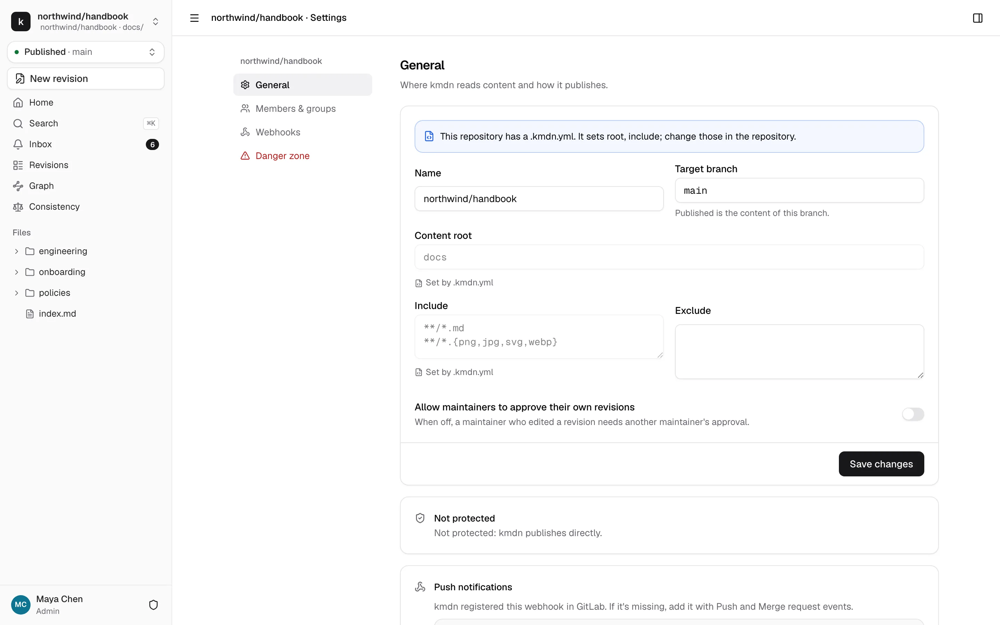
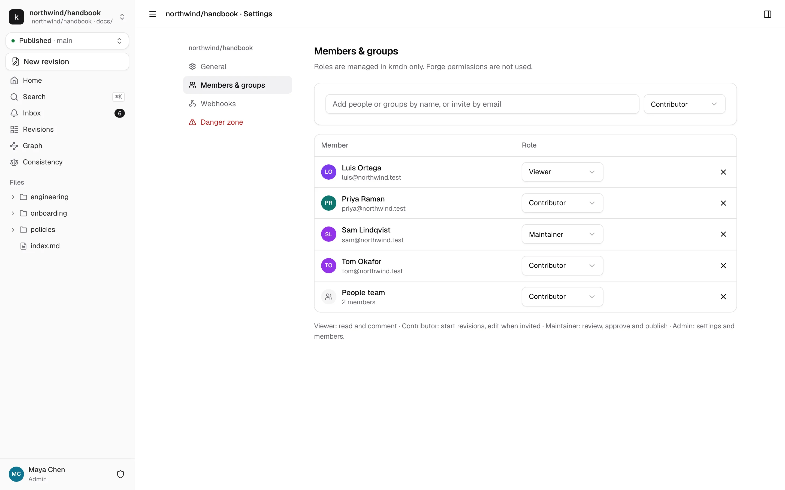
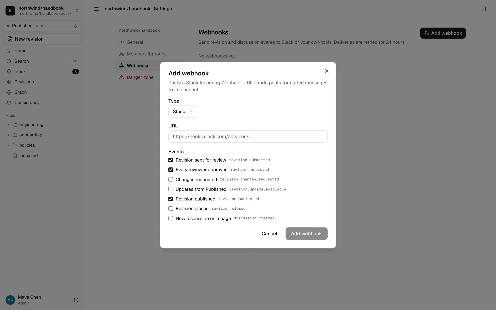

# Forges and repositories

kmdn edits markdown that lives in GitHub or GitLab. Connecting a repository takes two steps: connect the forge once for the instance, then connect each repository. Both happen in Admin console → Repositories, and only instance admins can do them.



kmdn supports:

| Forge | How kmdn connects | Sign in with it |
|---|---|---|
| GitHub.com and GitHub Enterprise Server | A private GitHub App that kmdn creates for the instance | Yes, through the same app |
| GitLab.com and GitLab self-managed | A project or group access token per repository | Optional, with a GitLab OAuth application |
| Any git remote | A URL and an optional token | No |

## GitHub

kmdn creates its own GitHub App through GitHub's app manifest flow, so you don't copy keys around.

1. Make sure the base URL is final, custom domain included. The app records it for its webhook and callback URLs.
2. Click **Create GitHub App**.
3. To create the app under an organization, enter its name. For GitHub Enterprise Server, enter your server's URL.
4. Click **Continue on GitHub** and confirm there. GitHub sends you back to kmdn, which stores the app's ID, private key and webhook secret, encrypted.
5. Install the app on the accounts whose repositories kmdn should reach. You can pick all repositories or a list.

The app asks for these permissions:

| Permission | Why |
|---|---|
| Contents: read and write | Read pages, push revision branches |
| Pull requests: read and write | Open a pull request for each revision, merge it on publish |
| Metadata: read | Repository basics |
| Administration: read | Detect branch protection rules |
| Email addresses: read | Credit people with their GitHub noreply address |

It subscribes to `push`, `pull_request` and `repository` events, sent to `<base URL>/hooks/github/<id>`. The same app handles **Continue with GitHub** on the sign-in page and account linking in profiles.

To connect a repository, click **Connect** on the GitHub card, pick the account the app is installed on, then the repository. If the account you need isn't listed, use **Install the app on another account**.

## GitLab



1. Click **Add GitLab** and enter the GitLab URL: `https://gitlab.com` or your own instance.
2. Optionally, let people sign in with GitLab. In GitLab, create an application in Admin area → Applications, or in a group's Settings → Applications. Make it confidential, give it the `read_user` scope and the redirect URI kmdn shows. Paste its ID and secret into kmdn. Without it, repositories still connect, and people just can't sign in with GitLab or get credited with their GitLab identity.
3. Click **Add**.

Each repository on that GitLab connects with an access token:

1. In GitLab, create a project access token, or a group access token for several projects. Give it the `api` and `write_repository` scopes and the Developer role. Use Maintainer if kmdn has to merge into a protected branch that only maintainers can merge to.
2. In kmdn, click **Connect** on the GitLab card and enter the project path, like `northwind/handbook`, and the token.

kmdn registers a webhook on the project for push and merge request events. GitLab access tokens expire, and kmdn can't replace a repository's token yet. Give the token the longest expiry your GitLab allows. When it expires, syncing fails and the repository's health shows **Sync failed**.



## Any git URL

The **Git remote** card connects any repository kmdn can clone: a Gitea or Forgejo server, a bare repository over SSH or HTTPS. Enter the git URL and, for private repositories, a token. kmdn pushes revision branches and publishes by writing the merge commit itself.

Plain git has no API, so kmdn can't open pull requests or detect protection there. It checks for new commits every five minutes. To make it immediate, have a git hook or your CI send a POST to the webhook URL shown in the repository's settings, with the `X-Kmdn-Token` header and a body like `{"branch": "main", "after": "<sha>"}`.

## Connection settings

When you connect a repository, or later in its settings, you choose:

- **Content root.** The folder kmdn shows, like `docs/`. Leave it empty to show the whole repository.
- **Target branch.** The branch that holds Published and that revisions merge into. It defaults to the repository's default branch.

kmdn clones the repository into its data directory. It only fetches the target branch, and file contents under the content root on demand, so a large repository with a small `docs/` folder stays cheap. The repository's health shows **Syncing** until the first clone finishes, then **Healthy**.

## Repository settings

Repository admins open the settings from the gear in the top bar, or **Repository settings** in the command palette.



### General

- **Name.** How the repository appears in kmdn.
- **Target branch** and **Content root**, as above.
- **Include** and **Exclude.** Glob patterns, one per line, that narrow which files appear. `**/*.md` shows every markdown file under the content root.
- **Allow maintainers to approve their own revisions.** Off by default, so a maintainer who edited a revision needs another maintainer's approval.
- **Protection.** Whether the target branch is protected on the forge, and what that means for publishing. kmdn merges through the forge's API either way. See [protected branches](../reference/git.md#protected-branches).
- **Push notifications.** The webhook kmdn registered on the forge, or the URL and token to add yourself for plain git.
- **Sync now.** Fetches the latest content and settings from the forge right away.

### `.kmdn.yml`

A `.kmdn.yml` file at the root of the target branch overrides some settings. The settings page marks the fields it sets as **Set by .kmdn.yml**, and you change those in the repository:

```yaml
root: docs/
include: ["**/*.md", "**/*.{png,jpg,jpeg,gif,svg,webp}"]
exclude: ["docs/_generated/**"]
assets:
  path: "{dir}/images/{name}.{ext}"   # where uploaded images go
  maxSizeMB: 10
routes:                                # how site URLs map to files, for the link checker
  "/docs/": "docs/"
templates: .kmdn/templates/            # page templates offered by Add page
```

The target branch can't be set from `.kmdn.yml`. A push to the repository shouldn't be able to change where kmdn writes.

### Instructions for the assistant

The assistant reads these files from the target branch on every run, so the repository decides how it writes. They don't have to be inside the content root. A change takes effect once kmdn has synced the push.

| File | What the assistant does with it |
|---|---|
| `AGENTS.md` | Follows it as the repository's instructions: conventions, words to use, what not to touch. kmdn reads the one at the repository root and the one at the content root. When both exist, the content root's file takes precedence. |
| `.kmdn/style.md`, `STYLE.md`, or `STYLE.md` in the content root | Uses it as the style guide when it writes, and the review summary checks changes against it. kmdn uses the first one it finds. |
| `.skills/` | Lists each skill by name and description. When a request matches one, the assistant reads the whole skill before it starts. |

A skill is a folder with a `SKILL.md` and any files it refers to, such as a template or examples. A single markdown file directly in `.skills/` also counts:

```text
.skills/
  release-notes/
    SKILL.md
    template.md
  glossary.md
```

`SKILL.md` starts with YAML frontmatter that names the skill and says when to use it:

```markdown
---
name: release-notes
description: How we write the monthly release notes page. Use when asked for release notes.
---
# Release notes

Start from template.md. One section per team, newest change first.
```

Without `name`, the skill takes the folder's (or file's) name. `.skills/` works at the repository root and in the content root. When both have a skill with the same name, the content root's wins.

These are the same files coding agents look for, so one `AGENTS.md` can serve people's own agents and kmdn's assistant. The assistant still follows kmdn's rules first: whatever these files say, it only suggests changes, and it never publishes, approves or changes settings. Anyone who can push to the target branch can change what the assistant is told, so review changes to these files like code.

Limits: 16,000 characters per `AGENTS.md`, 8,000 for the style guide, 50 skills, and 300 characters per skill description. kmdn cuts anything longer.

### Members and groups



Add people or groups by name and give them a role, or type an email address to invite someone new. Roles come from kmdn only. Permissions on the forge don't count. [People and access](people.md#roles) describes each role.

### Webhooks



Send revision and discussion events to Slack or to your own URL. A generic webhook posts JSON signed with a secret. A Slack webhook posts messages to a channel's incoming webhook URL. kmdn retries failed deliveries for 24 hours.

By default, webhooks can't reach private network addresses, so a webhook URL can't probe the network kmdn runs in. Set `hooks.allow_private` in the configuration to allow it.

### Danger zone

**Disconnect repository** removes it from kmdn, along with members' access to it in kmdn. The repository on the forge isn't touched. You type the repository's name to confirm.

## When the forge is unreachable

Editing keeps working when GitHub or GitLab is down. Saving and publishing need the forge. Publishing runs as a background job that retries, and Save all reports the error so people can try again once the forge is back. If a token stops working, the repository's health in Admin console → Repositories turns to **Sync failed**, with the forge's error. If the GitHub App is uninstalled or the repository deleted, it turns to **Disconnected**.
