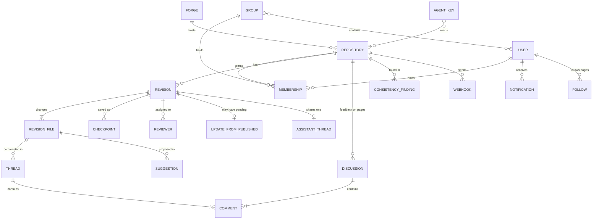

# Entities

This page describes the things kmdn stores and how they relate. It's written for admins and for anyone who reads the API or the audit log. The table definitions live in [the data model spec](../specs/10-data-model.md).

kmdn keeps two kinds of data:

- **Content lives in git.** Pages, images and their history are files and commits in your repository. kmdn keeps a mirror of each connected repository in its data directory, but the forge is the source of truth.
- **Collaboration lives in kmdn's database.** Revisions, comments, suggestions, approvals, people and settings. SQLite by default, PostgreSQL on Upsun.

## Overview

## People and access

**User.** Someone who can sign in. A user has a name, a verified email, an optional avatar and a co-author email for commits. There are no passwords. People sign in with an email link, a passkey, or a linked GitHub or GitLab account. A user is active or deactivated. Instance admins are users with the admin flag.

**Invite.** An email invitation to join the instance, optionally with a role on one repository. Accepting it creates the account. Invites are the only way in, unless the config lists email domains that may join on their own.

**Group.** A named set of users, like "People team". Instance admins manage groups. A group can hold a role on a repository, which every member inherits. Groups don't nest.

**Membership.** The role a user or a group holds on one repository: Viewer, Contributor, Maintainer or Admin. A person's effective role is the highest one they get directly or through a group.

**Session and passkey.** A signed-in browser, and a WebAuthn credential registered from the profile page. People can see and revoke both.

**Agent key.** A read-only credential for an external AI agent, created by an instance admin. It isn't a user. It has no session, can't see revisions or comments, and reads only published pages of the repositories it was given. See [Agent keys](../admin/agent-keys.md).

## Forges and repositories

**Forge.** A connection to GitHub through a GitHub App kmdn creates for the instance, to a GitLab instance, or to plain git remotes. It holds the credentials kmdn needs, encrypted with the instance's secret key.

**Repository.** A connected repository. Its settings name the target branch, which holds Published, the content root, which is the folder kmdn shows, and the include and exclude globs that decide which files count. A `.kmdn.yml` file at the root of the target branch can set the content root, globs, where images go, link routes and templates. The target branch can't be set from that file.

**Mirror.** kmdn's bare clone of the repository in the data directory. kmdn reads pages, history and blame from it and fetches after every push webhook, and every five minutes as a fallback.

## Revisions

**Revision.** A named set of changes to one or more pages, numbered per repository, like `#12`. It has a title, a description, a state, the people who can edit it, and the Published commit it's based on. On the forge, it's a branch named `kmdn/<number>-<slug>` with a draft pull or merge request. [How kmdn uses git](git.md) walks through that link.

**Revision file.** One page the revision touches: modified, added, renamed or deleted. While people edit, the page's live content is a shared collaborative document. kmdn turns it back into markdown on the server, and untouched parts keep their exact bytes.

**Checkpoint.** One Save all: a commit on the revision's branch, authored by the person who clicked, with the content of every page at that moment. Restoring a checkpoint brings its content back as new changes.

**Reviewer and approval.** A maintainer assigned to the revision, and their decision for the current review round: approved, asked for changes, or dismissed because the content changed after they approved.

**Update from Published.** Changes on the target branch that touch the revision's pages, prepared as a merge that waits for someone to preview and apply it. A revision has at most one pending update. See [Updates and conflicts](../user/updates-and-conflicts.md).

**Revision event.** One line in the revision's activity: started, saved, sent for review, approved, published, and so on.

## Discussion and suggestions

**Comment thread.** A conversation anchored to a passage in a revision. It's open, resolved, or detached when the passage it pointed to was deleted.

**Suggestion.** A tracked insertion or deletion by a person or by the assistant for a person. It's pending until an editor accepts or rejects it. Pending suggestions block publishing.

**Discussion.** A comment thread on a published page, outside any revision. It's anchored by the quoted text, so it follows the passage across published versions and shows as outdated when the passage disappears. **Fix this** turns it into a revision.

**Comment.** One message in a thread or discussion, with reactions.

## Assistant and consistency

**Assistant thread.** A conversation with the assistant. On the repository home and published pages, it's private to you. Inside a revision there's one thread, shared by everyone who can see the revision.

**Assistant run.** One answer from the assistant: which model, which tools it called, how many tokens it used. Runs count against budgets and appear in the audit log.

**Passage.** A section of a published page, chunked by heading, with an embedding. The consistency check compares passages.

**Consistency finding.** A pair of passages that contradict each other or say the same thing twice. A finding is open, ignored with a reason, being fixed in a revision, or closed once a later scan no longer finds it.

## Notifications and integrations

**Notification.** An inbox item: a review request, an approval, a reply, a publish. It can also arrive as a browser push if you allow it.

**Follow.** A page or folder you want to hear about. kmdn adds an inbox item when a revision that touches it is published.

**Webhook.** A per-repository outgoing hook that posts revision and discussion events to Slack or to your own URL.

**Audit entry.** An append-only record of a security-relevant action: sign-ins, role changes, publishes, agent key use, settings changes. It records that a secret changed, never its value.
