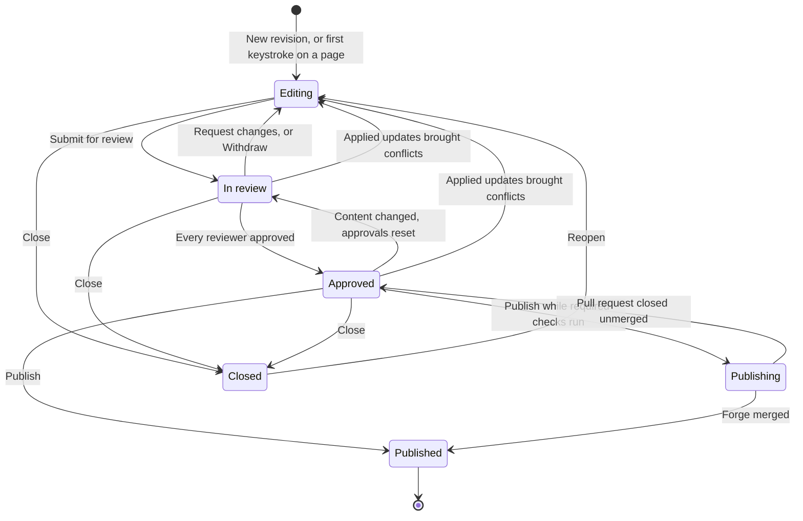
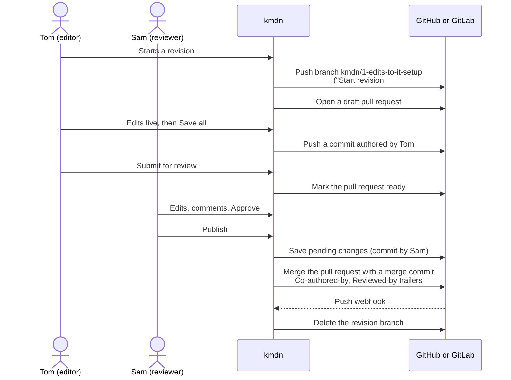
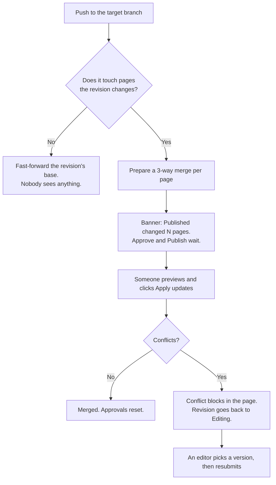

# How kmdn uses git

People who write in kmdn never have to think about branches or pull requests. Maintainers and engineers usually want to know exactly what lands in the repository, so this page spells it out.

In short, every revision is a branch with a pull request. Each Save all is a commit on that branch, authored by the person who clicked. Publishing merges the pull request with a merge commit. kmdn never squashes, rebases or force-pushes, so the target branch keeps every saved step.

## Revision lifecycle



## What happens on the forge



### Starting a revision

When a revision starts, kmdn queues a job that pushes a branch named `kmdn/<number>-<slug>` from the current Published commit. The first commit is empty, titled `Start revision #<number>: <title>`, and authored by the person who started it. GitHub refuses a pull request without commits, hence the empty one.

kmdn then opens a draft pull request on GitHub, or a draft merge request on GitLab, against the target branch. On GitLab, the title starts with `Draft:`. GitHub private repositories on free plans can't have drafts, so they get a regular pull request. Plain git remotes get the branch and nothing else.

The pull request description links back to the revision in kmdn and asks people to edit there, not by pushing to the branch.

### Saving

Live edits sync between people all the time, and the editor says **Synced**. They aren't in git yet. The top bar shows **Unsaved changes** until someone clicks **Save all**.

Save all writes one commit on the branch with the revision's current content and pushes it:

- The author is the person who clicked, with their co-author email. The committer is kmdn.
- The title names the changed pages, like `Update it-setup.md`.
- The message ends with a `Kmdn-Revision:` trailer that links back to the revision.
- If the content hasn't changed since the last commit, nothing happens and the button says **All changes saved**.

A few actions save first, as a commit by the person acting: Submit for review, applying updates from Published, restoring a checkpoint, and Publish.

kmdn owns the branch. If someone pushes to it outside kmdn, the next save stops with "The branch changed outside kmdn". kmdn doesn't import those commits.

### Draft and ready

The pull request is a draft while the revision is in Editing, and ready for review while it's in review or approved. Submit for review marks it ready. Withdraw, Request changes and conflicts from updates turn it back into a draft.

Reviews, comments and approvals happen in kmdn. kmdn doesn't read reviews or comments made on the forge.

### Publishing

Publishing requires an approved revision with no pending suggestions, no conflicts and no pending update from Published. Then kmdn:

1. Saves any unsaved changes, as a commit by the person publishing.
2. Marks the pull request ready if it's still a draft.
3. Merges it through the forge's API with the **merge** method, pinned to the branch tip kmdn pushed. GitHub makes and signs the merge commit. On a plain git remote, kmdn writes the merge commit itself.
4. Fetches the result, marks the revision Published, notifies people and fires webhooks.
5. Deletes the revision branch.

The merge commit message looks like this:

```
IT setup: three-year laptop refresh, first-day checklist

Match the laptop policy and give new hires a short checklist for
their first day.

Kmdn-Revision: https://docs.northwind.example/northwind/handbook/revisions/1
Co-authored-by: Tom Okafor <12345+tokafor@users.noreply.github.com>
Co-authored-by: Priya Raman <priya@northwind.example>
Reviewed-by: Maya Chen <maya@northwind.example>
Assisted-by: kmdn-assistant
```

- The title and body come from the Publish dialog. The review assistant proposes them, and the maintainer can edit both.
- `Co-authored-by` lists everyone whose inserted text survives in the final result, or whose suggestion was accepted. Commenters aren't co-authors. The list is ordered by how much of their text survives.
- `Reviewed-by` lists the reviewers who approved.
- `Assisted-by: kmdn-assistant` appears when some surviving text came from the assistant. The person who asked for that text is credited as a co-author.
- The email for each person is their co-author email from their profile: the forge noreply address when they linked a GitHub or GitLab account, otherwise their kmdn email or another verified address.

### Protected branches

kmdn merges through the forge's API, so protection rules that only restrict pushes don't stop it. If the forge refuses because required checks are still running, kmdn turns on auto-merge: GitHub's auto-merge, or GitLab's "merge when pipeline succeeds". The revision stays in **Publishing** until the forge merges and the webhook arrives.

Two cases kmdn can't handle for you:

- **Required approvals on the forge.** kmdn's bot opened the pull request, so it can't approve it. Add the kmdn GitHub App, or the GitLab token's bot user, to the rule's bypass list, or approve the pull request on the forge.
- **Merge commits disabled.** A repository that only allows squash or rebase merges can't be published to. The Publish dialog says so.

If someone merges the pull request on the forge, kmdn marks the revision Published with that merge commit. If someone closes it without merging, the activity notes it, and a publish in progress stops.

## Updates from Published

When the target branch moves, kmdn checks each open revision:



kmdn's merge works on markdown blocks, not raw lines. Changes to neighbouring paragraphs merge cleanly. Only changes to the same passage, or two insertions in the same place, conflict.

After someone applies updates, the next commit on the branch has two parents: the branch tip and the new Published commit. The pull request then shows only the revision's own changes.

## History and blame

A page's **published versions** are the commits on the target branch that changed it, following the first parent. Each publish shows as one version, and the commits people saved on the revision branch stay in the repository's history and in blame.

## Direct pushes still work

Engineers can keep pushing to the target branch from their laptops or CI. kmdn fetches after each push webhook, or within five minutes without one. Readers see the new Published content, and open revisions that touch the same pages get an update to apply.

If the target branch's history is rewritten, the next update treats the new head as Published and merges by content. The revision's activity notes that Published history was rewritten.
