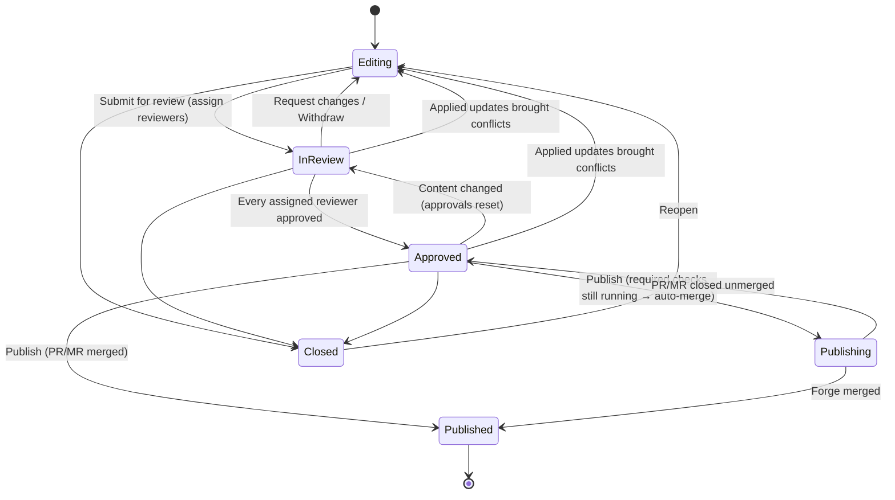

# 07 · Review

## Revision lifecycle

States: **Editing**, **In review**, **Approved**, **Publishing**, **Published**, **Closed**. "Changes requested" and "Conflict" are not states: they are flags on an Editing revision (`changes_requested`, `has_conflicts`) shown as their own pills in lists ("Changes requested", "Conflict") so people can scan for what needs them.

### Who can do what, by state

| | Editing | In review | Approved |
|---|---|---|---|
| Revision editors (creator + invited) | Edit, suggest, comment, file ops, submit | **Read-only.** Comment, reply, accept/reject reviewer suggestions, withdraw | Read-only. Comment |
| Assigned reviewers | Comment (if they can see it) | **Edit directly**, suggest, comment, file ops, approve, request changes | Edit (resets approvals), publish |
| Other maintainers | Edit (maintainers can always edit an Editing revision) | Comment. Can ask to be added as reviewer | Comment, publish |
| Everyone else in the repo | View, comment | View, comment | View, comment |

Rules:

- **Submit for review** requires at least one assigned reviewer. Reviewers are chosen from the repo's Maintainers/Admins, every instance admin, and anyone who took part in the revision (edited a page, commented, changed files) with at least Contributor access. **Admins (instance or repo) can always be added**, even when they edited the revision. The revision's people list shows everyone who took part, not only invited editors. kmdn suggests reviewers from who maintains the touched folders (most published commits reviewed in those paths over the last 6 months), falling back to all maintainers. A revision editor who isn't an admin can't be their own reviewer unless the repo setting **Allow self-approval** is on (off by default).
- **Review happens in the editor.** Assigned reviewers open the same editing view as editors, with direct edit rights. Their edits are live, attributed to them, and credited as `Co-authored-by` on publish (plus `Reviewed-by`). Reviewers can still switch on Suggesting when they'd rather propose than change.
- **Editors are read-only while In review**, so the reviewers have a stable target. They keep comments, replies, and accept/reject on suggestions reviewers make. To change something themselves, they **Withdraw from review** (back to Editing, approvals dismissed, reviewers notified).
- **Approval**: every assigned reviewer must approve. Any content change (reviewer edit, accepted suggestion, file op, applied updates from Published) resets the approvals of every reviewer *other than the one who made the change*. The UI shows "Approved 1 of 2" and who still has to approve.
- **Request changes**: any assigned reviewer can send the revision back to Editing with a note. Existing approvals are dismissed. The same reviewers are re-requested automatically on the next submit (the editor can change them).
- **Reviewer changes**: editors can add/remove reviewers while In review; removing the last reviewer returns it to Editing. A maintainer not assigned can "Ask to review", which the editors accept.
- **Updates from Published are previewed, then applied** (see [06](06-git-and-forges.md#updates-from-published)). While a revision has pending updates, Approve and Publish are blocked. Any editor applies them while Editing; an assigned reviewer applies them while In review or Approved. Applying changes content, so approvals reset.
- **Conflicts go back to editing.** If applied updates bring conflicts into an In review or Approved revision, it returns to **Editing** with `has_conflicts`, approvals are dismissed, editors and reviewers are notified. The original editors resolve the conflicts together in the editor, then resubmit to the same reviewers.
- **Publish** is a separate click by any Maintainer/Admin once Approved, blocked while suggestions or updates from Published are pending.
- **Close**: editors or maintainers. Closed revisions are read-only, reopenable for 90 days, then archived (Y.Docs compacted to a final snapshot).
- **Stale** badge after 30 days without activity. No auto-close in v1.

## Submit for review

Dialog: title, description (the assistant can write it from the diff), reviewers (suggested, editable, at least one), checks summary (broken links, pending suggestions, unresolved threads: warnings, not blockers). Unsaved changes are saved first (a commit). Revision → In review, and its pull/merge request leaves Draft ([06](06-git-and-forges.md#revision-branches)); assigned reviewers get an inbox item (and a browser push if enabled). Going back to Editing (withdraw, request changes, conflicts) turns the pull request back into a draft.

## Comments

- **Threads anchored to ranges** using Yjs relative positions (stored in the Y.Doc `comments` map); bodies in the DB.
- Markdown-lite bodies (bold, italic, code, links, @mentions). @mention autocompletes repo members; mentioning someone without access prompts to invite them as Viewer.
- Actions: reply, edit own, delete own (soft delete, "Comment deleted"), resolve, reopen, react (👍 ✅ 👀 as a small fixed set), link to comment.
- If the anchored text is deleted, the thread is kept as "Detached" and shown at the top of the Comments tab with its original quoted text.
- **Sort**: the Comments panel sorts by **Hot topics** (default) or **Last updated**. Hot score = replies and reactions weighted by recency (`Σ w·e^(−age/6h)`, replies w=1, reactions w=0.3, new participants +0.5), recomputed on each activity. Each thread shows its activity ("5 replies · active 3 min ago"). Filters: All / Suggestions / Comments / Mine / Unresolved.
- One comment object for editing and review; threads created while In review carry `review_round` so the review summary can list them. No batching: comments post immediately.
- Unresolved threads don't block publishing but are listed in the Publish dialog.

## Suggestions

See [05 · Suggestions](05-collaboration.md#suggestions-tracked-changes). Review-specific behavior:

- Reviewers can edit directly or toggle Suggesting; editors can use Suggesting while Editing.
- Each suggestion gets an optional thread (reply to discuss before accepting).
- Suggestions are listed with threads in the Comments panel and follow the same sort.

## Result and changes views

Review uses the editor, with a **Result | Changes** switch in the editor toolbar (plus **Source diff**):

- **Result** (default): the page as it will be published. Deleted content is hidden. Changed passages get a thin gutter bar and a light highlight on inserted text, with a hoverable "Changed" chip. This is the view reviewers edit in.
- **Changes**: the full rendered diff inline: insertions highlighted + underlined, deletions struck through, moved blocks labeled "Moved from §…", frontmatter changes as a property diff table, images before/after. Read-only.
- **Source diff**: markdown line diff, split or unified, word-level highlights, ±3 lines of context, expandable hunks. Line comments anchor back to the Y.Doc range when possible, otherwise to the line (shown as outdated when the line changes).

Diffs compare the revision's materialized markdown with published content at `base_sha` (the Published commit the revision last applied updates from). Navigation between changed files uses the contextual sidebar's **Changed in this revision** list (see [02](02-ux.md#contextual-sidebar)). There is no per-file "viewed" checkbox.

## Review assistant

For assigned reviewers (and on demand for editors before submitting), the assistant produces a **review summary card** at submit time and on request:

- One-paragraph summary of what changed and why (from the diff + revision thread).
- Checks: broken internal links/anchors, images missing alt text, frontmatter keys changed/removed vs. other files in the same folder, heading level jumps, style-guide issues from `STYLE.md` or `.kmdn/style.md` if present.
- Suggested commit title/body.
- Every finding links to the exact location; "Fix" on a finding creates assistant suggestions.

The summary is advisory and never blocks.

## Doc discussions (published docs)

- Anyone with Viewer+ can comment on the published view.
- Anchors: stored as `{quote, prefix, suffix, sha}` (W3C Web Annotation-style TextQuoteSelector: up to 32 characters of context on each side, and the published commit). The page highlights the occurrence whose context matches best (CSS Custom Highlights, so the rendered page isn't modified). On each new published commit touching the file, re-anchoring looks for the quote in the page's text (exact, then with whitespace and case folded): found → it moves to the new commit; unfound → "Outdated" with the original quote shown.
- Threads have the same actions as revision comments, plus **Fix this** (contributors): creates a revision ("Fix: <doc title>") with the page in it and the feedback (quote and comment) as its description, and links the discussion to the revision ("Being fixed in #12"). Once the assistant exists (M4), it opens briefed on the comment. When the revision publishes, the discussion is auto-resolved ("Fixed in #12").
- Discussions are listed in the doc's Comments tab (published view) and on the repo home ("Open feedback").
