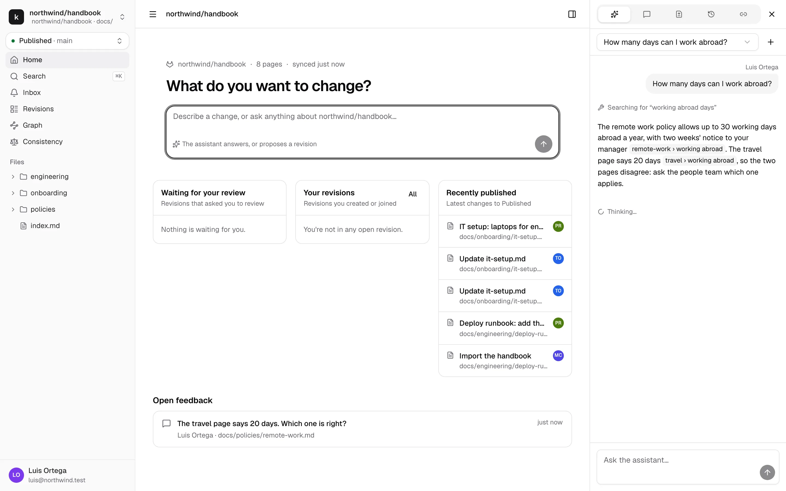
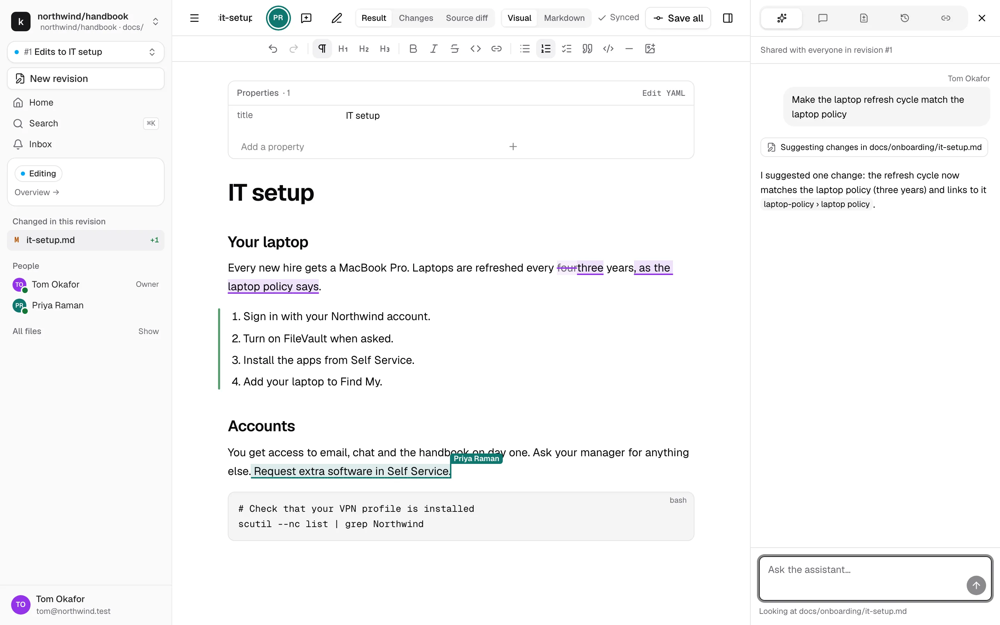
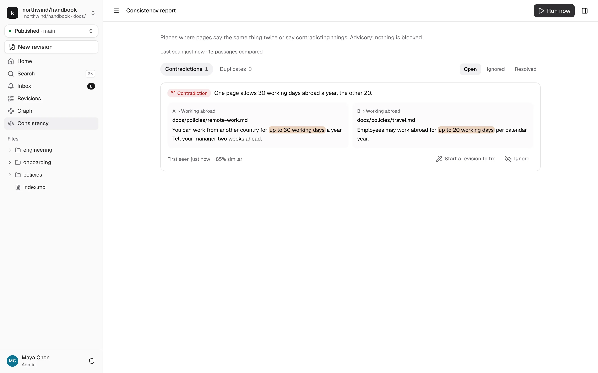

# The assistant

The assistant is kmdn's built-in AI helper. It reads the repository to answer questions, and it can change pages in a revision, always as suggestions you accept or reject. It never publishes, approves, resolves threads or changes settings.

Your instance has it if an admin connected an AI provider. Otherwise the Assistant tab says so.

## Ask a question

Type in the box on the repository home, or open the Assistant tab in the right panel on any published page. The assistant searches the published pages, reads the relevant ones and answers. Each fact it takes from the docs has a chip that links to the page and heading it came from. When an answer has no source, it says so.

In this example, the two pages it cites disagree, and the answer says so.

These conversations are private. The menu at the top of the tab lists your past conversations, and **+** starts a new one.

## Ask for a change

Ask for a change in a private conversation, like "Add a checklist for the first day to the IT setup page", and the assistant proposes a revision: a card with a title and the pages it plans to touch. **Start revision** creates it, and the conversation moves into the revision, where its collaborators can read it. kmdn warns you before it moves.

## In a revision

Inside a revision, the Assistant tab holds one conversation shared by everyone who can see the revision. Everyone sees every message and who wrote it. People who can edit the revision can ask the assistant for changes. Others can read along.

The assistant's edits arrive as suggestions in the page, marked "Assistant for" the person who asked. Accept or reject them like anyone else's. When the revision is published, the person who asked is credited as the co-author of that text, and the merge commit notes that the assistant helped.

Adding, renaming or deleting a page is a proposal you confirm in the conversation.

One answer runs at a time per revision. A second request waits, marked **Queued**.

Good requests are specific and point at a page or a passage:

- "Make the laptop refresh cycle match the laptop policy"
- "Turn the Tuesday to Thursday section into a checklist"
- "Explain this conflict and propose a merged version"
- "Write the description for this revision"

## How the repository guides it

The repository can tell the assistant how to write. Maintainers put these files on the target branch:

- `AGENTS.md`: the team's instructions, such as the words to use or the pages to leave alone.
- A style guide, `STYLE.md` or `.kmdn/style.md`.
- Skills in `.skills/`, for tasks with a set way of working, like release notes or a runbook.

When your request matches a skill, the assistant reads it first. The conversation shows **Using the skill release-notes**. To change how the assistant behaves for everyone, change these files in a revision, or ask a maintainer. [Instructions for the assistant](../admin/repositories.md#instructions-for-the-assistant) describes the format.

## Consistency findings

If your admin turned on consistency checks, kmdn compares passages across the repository to find ones that contradict each other or repeat each other.

In a revision, findings about the passages you changed show:

- In the overview's **Consistency** section, and in the Publish dialog
- As underlines in the editor: wavy for a contradiction, dotted for a duplicate. Hover for details

For each finding you can:

- **Fix.** The revision's assistant rewrites the passage to match, as suggestions.
- **Link instead.** For a duplicate, replace the repeated passage with a link to the other page.
- **Ignore**, with a reason. kmdn remembers it until one of the two passages changes.

Findings are advice. They never block a review or a publish.

### The consistency report

Maintainers see **Consistency** in the sidebar: the contradictions and duplicates across Published, from the weekly scan or from **Run now**.

Each finding shows both passages side by side. **Start a revision to fix** opens a revision with both pages, and the assistant already knows what to fix. Findings close themselves when a later scan no longer finds them, for example once the fix is published.
