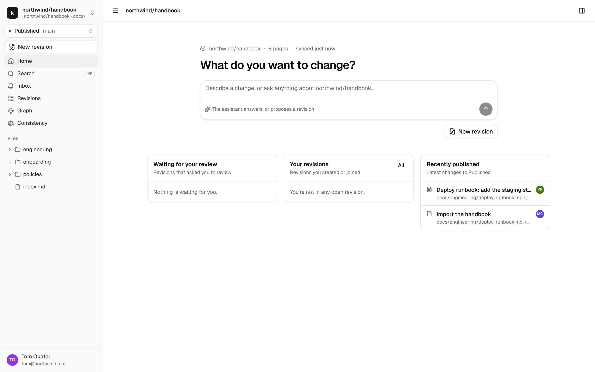
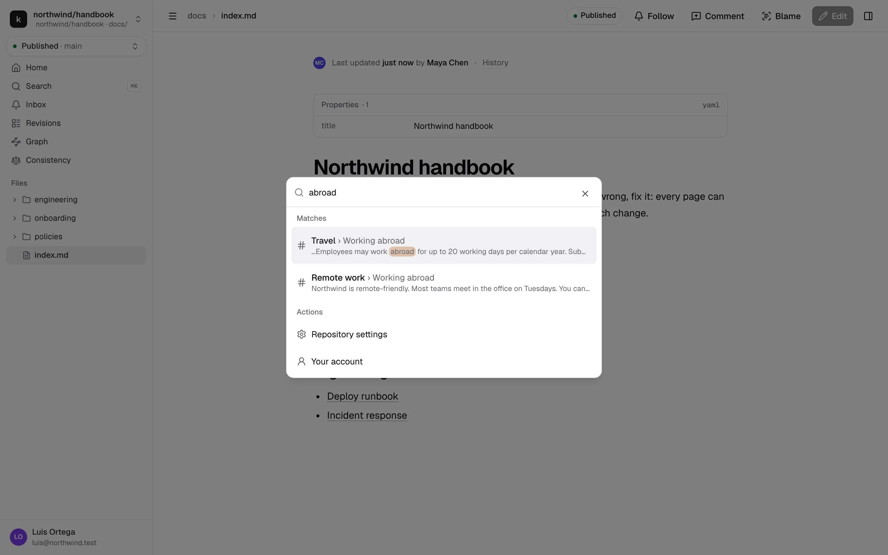
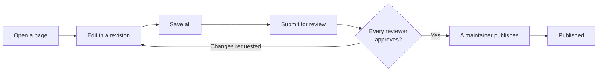
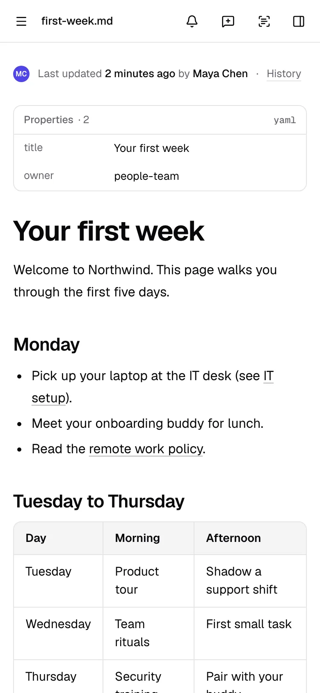

# Getting started

kmdn is where your team reads and edits its documentation. The pages live in a GitHub or GitLab repository, but you don't need to know anything about git to use kmdn. You open a page, change it, and ask someone to review it. Once they approve, it's published.

## Sign in

You get an invite by email, or your admin lets people from your company's email domain join on their own. Go to your kmdn address, enter your work email and click **Email me a sign-in link**.

The email has a link and a 6-digit code. Click the link, or type the code if you opened the email on another device. Links work once and expire after 15 minutes.

After your first sign-in you can add a passkey in [your profile](notifications-and-profile.md#your-profile), and sign in with your fingerprint or face after that. If your admin connected GitHub or GitLab, **Continue with GitHub** or **Continue with GitLab** works once you've linked that account.

## Find your way around

**The sidebar**, on the left:

- The repository switcher, at the top, when you have access to several.
- The revision picker, just below it. It says where your edits go: **Published** when you're reading, or the name of a revision when you're editing one. See [Revisions](revisions.md).
- Home, Search, Inbox, Revisions, Graph and Consistency.
- The files of the repository.
- Your name at the bottom, with your profile, the theme and sign out.

**The top bar** shows where you are and the main action for the page: Edit, Submit for review, Approve, Publish, depending on the page and your role.

**The right panel** opens with the panel button at the top right, or with ⌘. on a Mac and Ctrl+. elsewhere. It has five tabs:

| Tab | What's in it |
|---|---|
| Assistant | Ask questions about the docs, or ask for changes inside a revision |
| Comments | Comment threads and suggestions on the page, sorted by activity |
| Changes | What a revision changes on this page |
| History | Published versions of the page |
| Links | A small map of the pages around this one, and every link in and out |

**The command palette** opens with ⌘K, or Ctrl+K. Type to find a page or a heading, or pick an action.

## How a change gets published

You can invite others to edit with you at any point before you submit. Reviewers can fix things themselves instead of sending the revision back.

## What you can do

Your role in each repository decides what you can do there. Ask a repository admin if you need more.

- **Viewer.** Read, search, ask the assistant, follow pages, comment.
- **Contributor.** Also start revisions and edit the ones you're invited to.
- **Maintainer.** Also review, approve and publish, and edit any revision that's being edited.
- **Admin.** Also change the repository's settings and members.

## On your phone

On a phone, kmdn is for reading, commenting and reviewing. You can approve, request changes and publish from the bottom bar. Editing works on tablets and computers.

## Next

- [Read, search and give feedback](reading.md)
- [Edit pages in a revision](revisions.md)
- [Review and publish](review-and-publish.md)
- The [glossary](../reference/glossary.md) explains every term kmdn uses.
