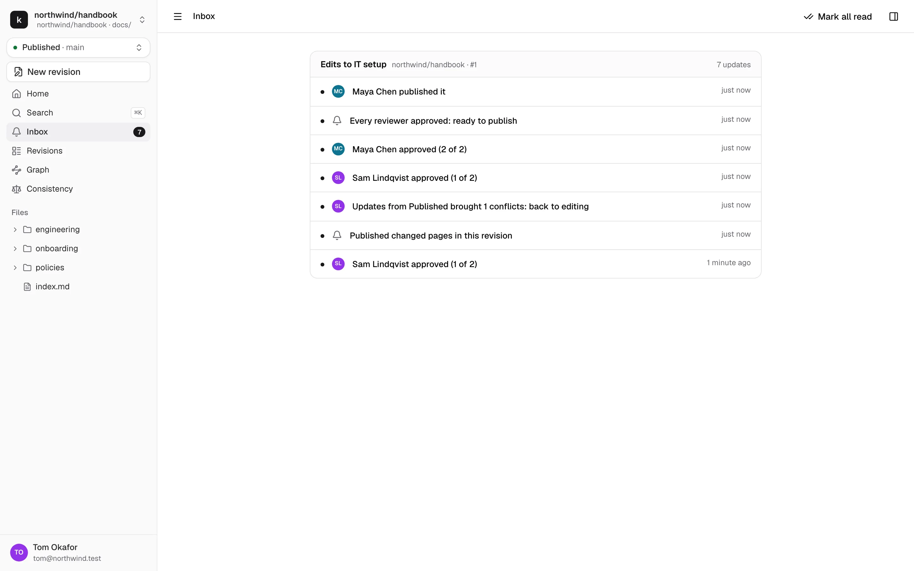
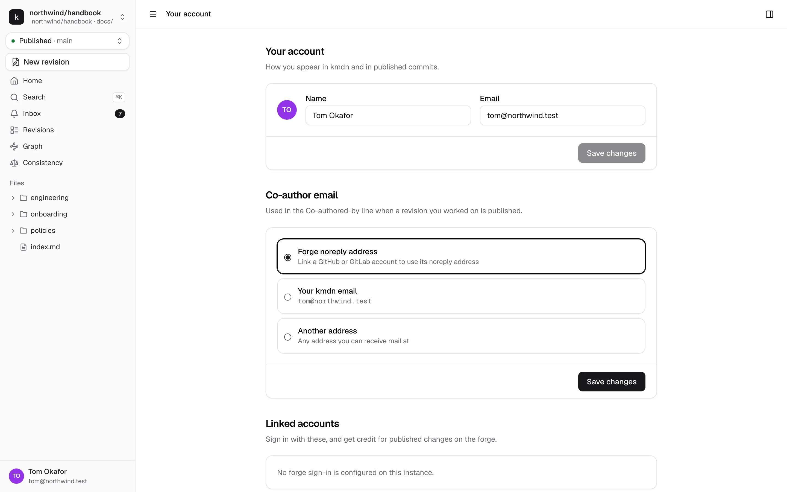

# Notifications and your profile

## Inbox

kmdn doesn't send notification emails. Everything that needs you lands in your inbox, marked with a count in the sidebar, and arrives live while kmdn is open.

Items are grouped per revision, newest first. Click one to open it, or **Mark all read**.

You hear about:

| Event | Who gets it |
|---|---|
| Someone mentions you | You |
| Your review is requested, or requested again | Assigned reviewers |
| A reviewer approves, or every reviewer has approved | Editors and the other reviewers |
| Changes are requested | Editors and the other reviewers |
| Published changed pages in the revision | Editors in Editing, reviewers in review |
| Updates brought conflicts, back to editing | Editors and reviewers |
| The revision is published, or waiting for the forge to merge it | Editors and reviewers |
| Someone replies in a thread you're in | Thread participants |
| You're added to a revision | You |
| A page you follow is published | Followers |

You don't get notifications for things you did yourself.

## Browser notifications

In your profile, under **Notifications**, click **Allow browser notifications** to get them even when kmdn isn't in front of you. It's per browser, so do it on each device you use. kmdn sends at most one per revision every five minutes, and none while you have the revision open.

The same table lets you turn each kind of event on or off, for the inbox and for the browser separately.

## Your profile

Open it from your name at the bottom of the sidebar.

**Name and email.** How you appear in kmdn and in published commits.

**Co-author email.** When a revision you worked on is published, the commit credits you with a `Co-authored-by` line. Choose which address it uses:

- **Forge noreply address.** Your GitHub or GitLab noreply address, once you've linked that account. The forge then shows your avatar on the commit and counts it as yours, without exposing your real email.
- **Your kmdn email.**
- **Another address** you can receive mail at.

**Linked accounts.** Link your GitHub or GitLab account to sign in with it and get credit on the forge. It only shows when your admin set up forge sign-in.

**Passkeys.** Sign in with your device's fingerprint, face or PIN instead of an email link. Click **Add a passkey** and follow your browser. Passkeys synced by your password manager work on your other devices too. Name them so you can tell them apart, and remove the ones you don't use.

**Appearance.** Light, dark, or follow your system.

**Signed-in devices.** Every browser signed in to your account, with when it was last active. Sign out of the ones you don't recognise.
