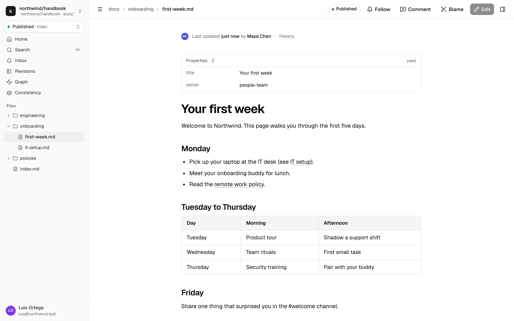
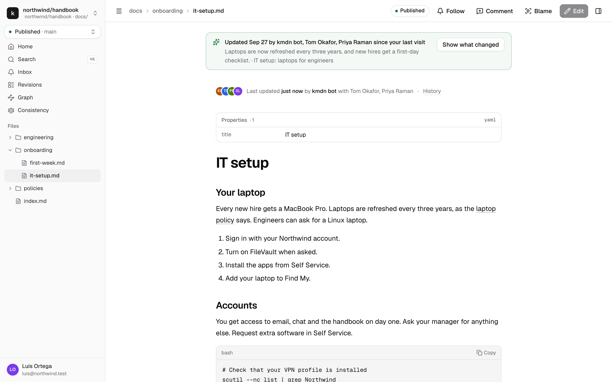
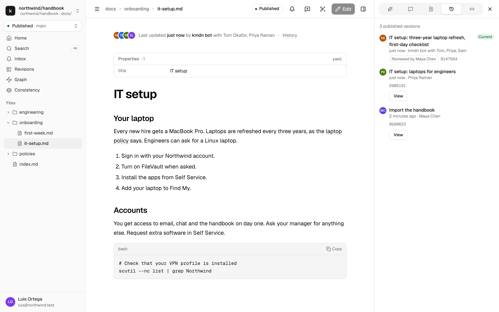
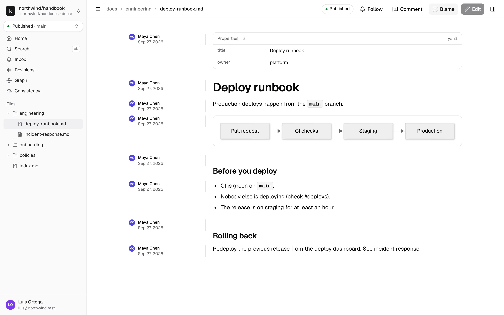
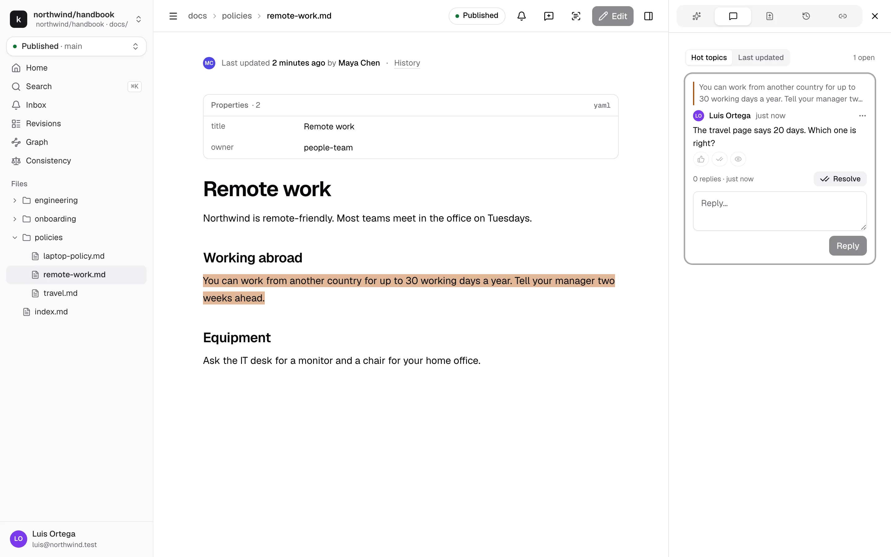
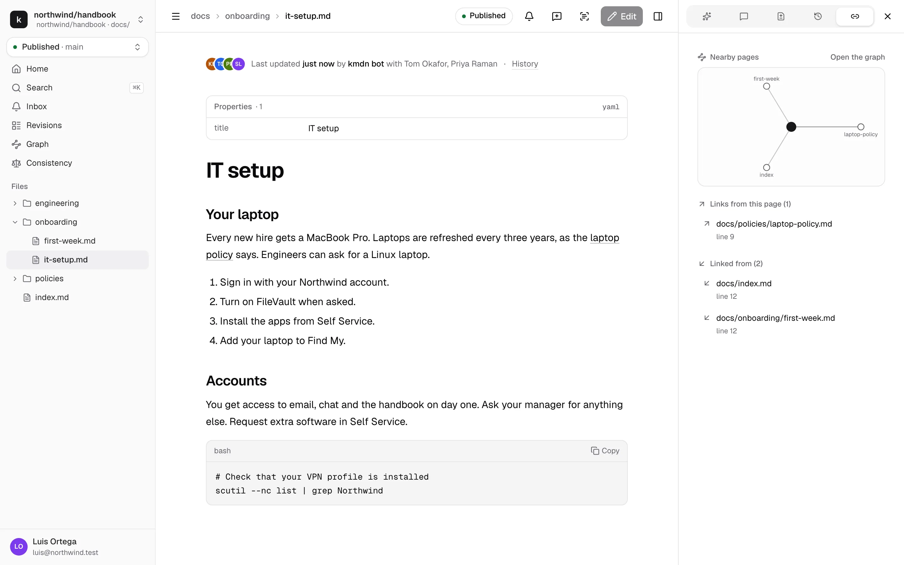
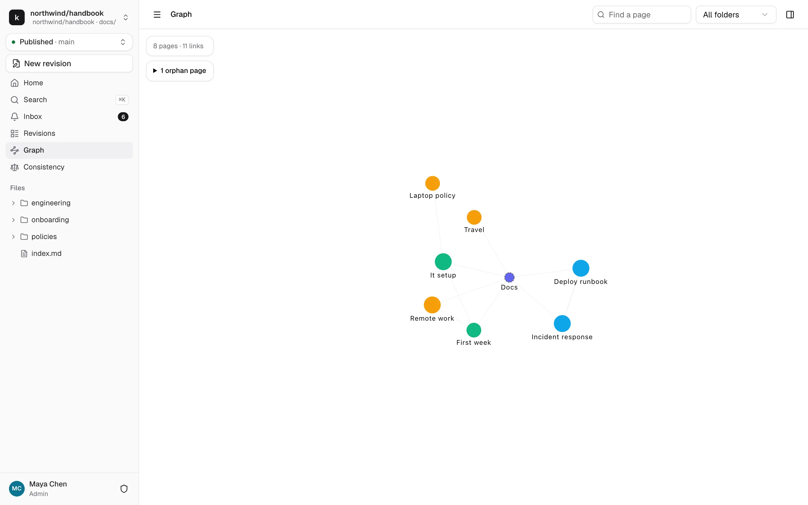

# Read, search and give feedback

Everything in this page works for every role, Viewers included.

## Read a page

Open a page from the file tree, from search, or from a link. The page shows its properties first, which is the front matter at the top of the markdown file, then the content. Code blocks have a copy button. Mermaid diagrams and math render in place.

Above the title, a byline says who last changed the page and when. **History** next to it opens the list of published versions.

## Updated since your last visit

kmdn remembers when you last read each page. If it changed since then, a banner says who changed it and what's different, in a sentence or two written by the assistant. **Show what changed** highlights the changed passages in place.

## Follow pages

Click **Follow** in the top bar to get an inbox item whenever a revision that changes this page is published. When you edit a page, you follow it automatically for 30 days after your change is published. Click **Following** to stop.

## History and blame

The History tab in the right panel lists the page's published versions: who wrote each change, who reviewed it, and the commit. **View** opens the page as it was.

**Blame**, in the top bar, shows next to each block who last changed it and when.

## Search

Press ⌘K, or Ctrl+K, anywhere and type. Results match page titles, headings and text, and jump straight to the heading. The palette also lists actions like New revision or Repository settings.

## Ask the assistant

If your instance has the assistant, type a question in the box on the repository home, or in the Assistant tab of the right panel. The assistant searches and reads the published pages, and cites every page it used as a chip you can click.

These conversations are private to you. If you ask for a change, the assistant proposes to start a revision, and the conversation moves there where your collaborators can see it. See [The assistant](assistant.md).

## Give feedback on a page

Select text on a published page and click **Comment** in the top bar. Write your comment and post it. The passage stays highlighted, and the thread shows in the Comments tab. Others can reply, react and resolve it.

Feedback sticks to the text you selected. When the page changes, kmdn finds the passage again. If the passage is gone, the thread is marked outdated and keeps the original quote.

Open feedback also shows on the repository home, so maintainers see it.

### Fix this

Contributors see **Fix this** on a feedback thread. It starts a revision with the page in it and the feedback as its description, and the thread says "Being fixed in #12". When that revision is published, the thread resolves itself with "Fixed in #12".

## Links and the graph

The Links tab shows a small graph of the pages around the current one, then every link from this page and every page that links here. Broken links are flagged.

**Graph** in the sidebar shows every page in the repository and how they link. Pages nobody links to are listed as orphans. Search for a page or filter by folder.

