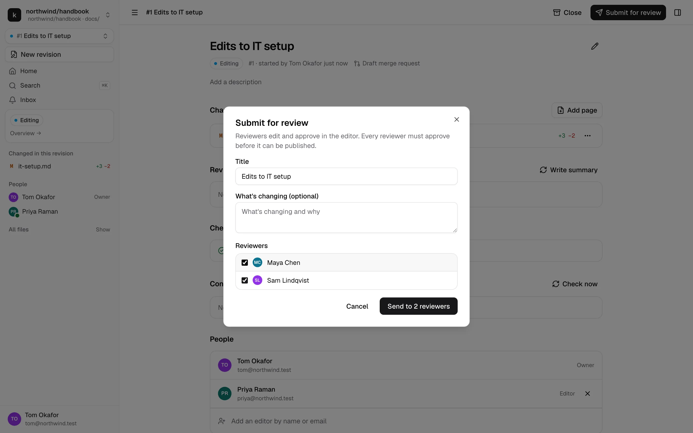
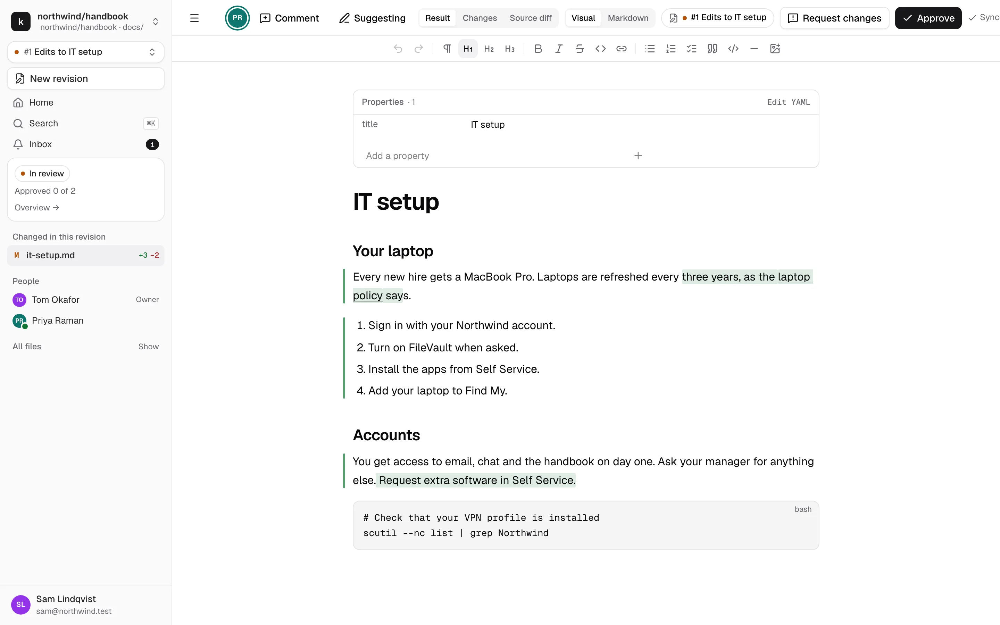
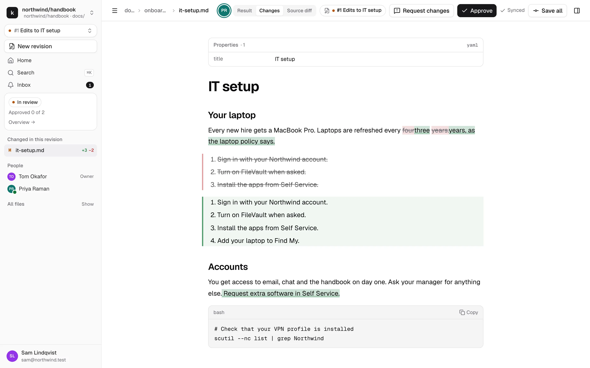
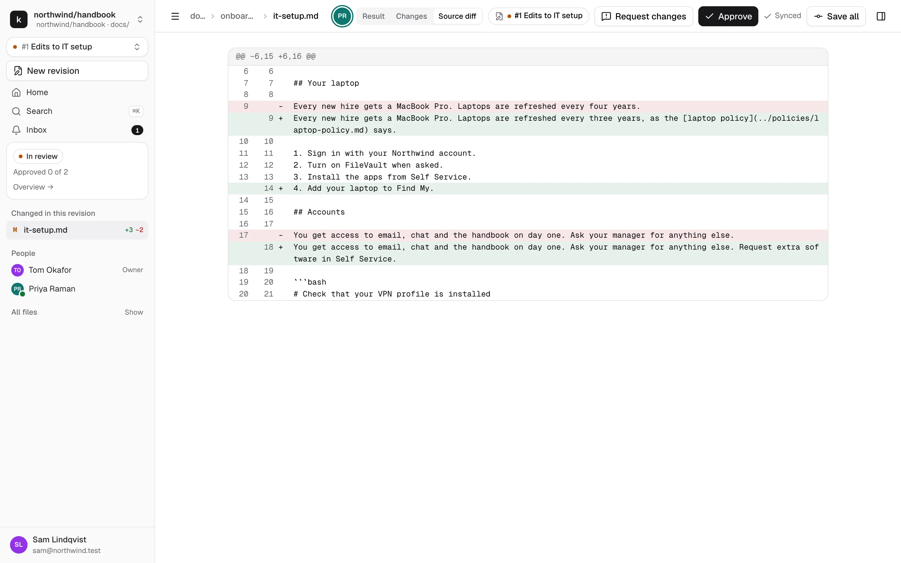
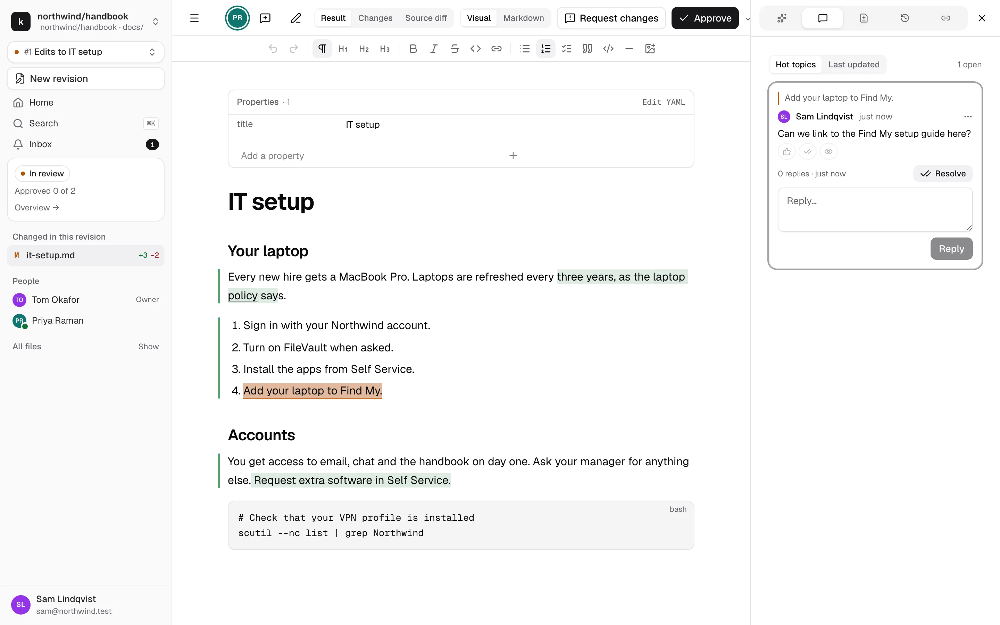
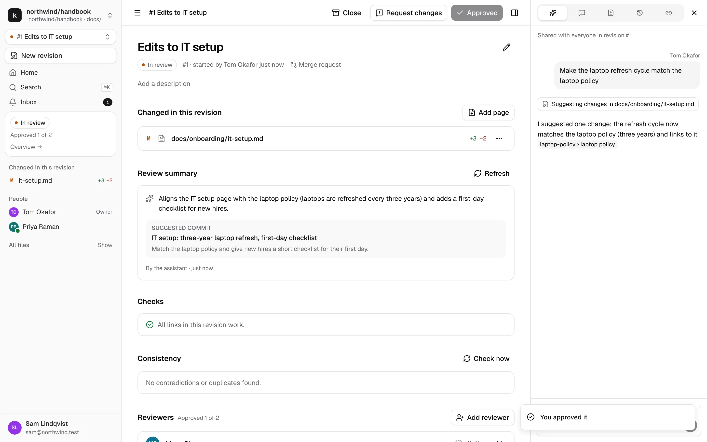
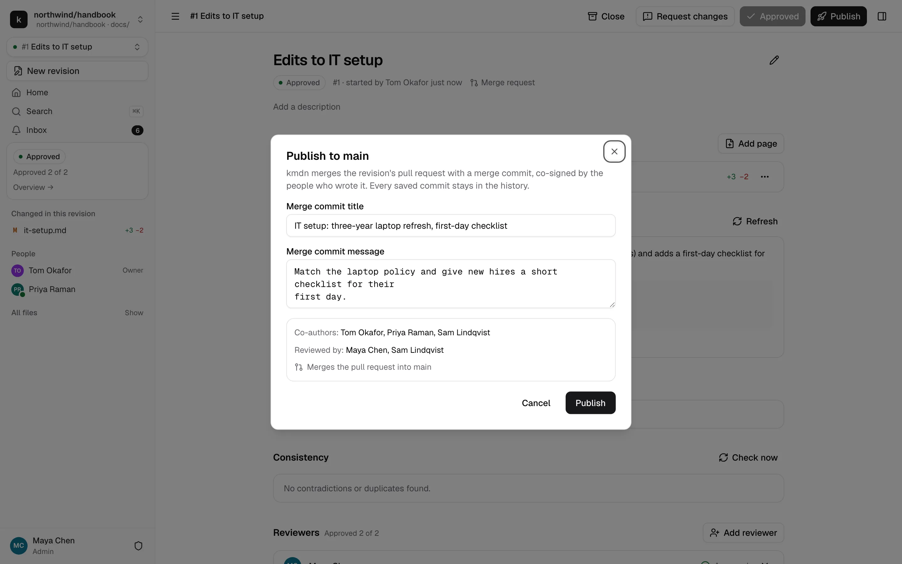
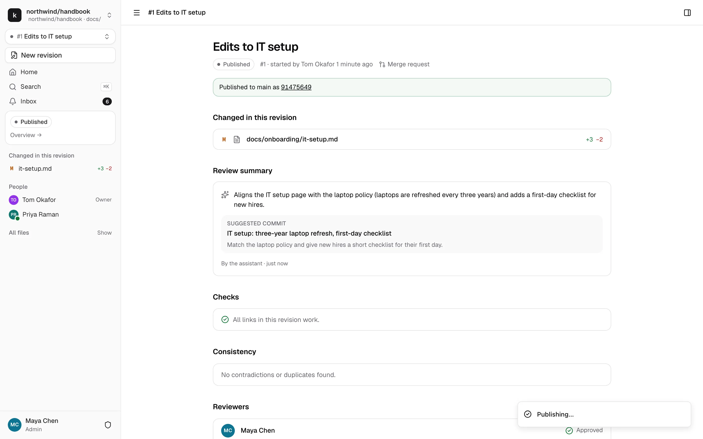

# Review and publish

A revision reaches Published in three steps: its editors submit it, every assigned reviewer approves it, and a maintainer publishes it. Reviews happen in the same editor you write in.

## Submit for review

When the revision is ready, click **Submit for review** in the top bar or on the overview.

- **What's changing.** An optional description for reviewers.
- **Reviewers.** Pick at least one maintainer. kmdn marks the people who usually review the pages you changed as **Maintains these pages**. You can't review your own revision unless the repository allows it.
- **Warnings.** Broken links and similar problems show here. They don't stop you from submitting.

**Send to 2 reviewers** saves the revision first, then hands it over. The reviewers get an inbox item, and a browser notification if they turned those on.

### While it's in review

The revision's editors become read-only, so reviewers have a stable version to look at. Editors can still comment, reply, and accept or reject the suggestions reviewers make. To change something yourself, click **Withdraw**: the revision goes back to Editing, approvals are dismissed and the reviewers are told.

Editors can add or remove reviewers while the revision is in review. Removing the last one sends it back to Editing.

## Review

Open the revision from your inbox, from **Waiting for your review** on the repository home, or from the revisions list. Move between changed pages with **Changed in this revision** in the sidebar.

As an assigned reviewer, you have three views, switched in the editor bar:

**Result**, the default, shows the page as it will be published. A bar in the margin marks changed passages, and inserted text is lightly highlighted. You edit in this view.

**Changes** shows the full diff in place: insertions underlined, deletions struck through, property changes side by side. It's read-only.

**Source diff** shows the markdown line by line, the way a code review would.

### Fix things directly

Reviewers don't have to ask for every typo to be fixed. You can edit the page directly. Your change goes live for everyone, it's credited to you, and you're listed as a co-author when the revision is published. If you'd rather propose, turn on **Suggesting**.

### Comment

Select text and click **Comment**. Threads show in the Comments tab, where editors reply.

### The review summary

When a revision is submitted, the assistant writes a summary on the overview: what changed and why, a suggested commit title, and checks such as broken links, images without alt text, heading levels that jump, and style guide issues if the repository has a `STYLE.md`. **Fix** on a finding asks the assistant to fix it as suggestions. The summary is advice, it never blocks anything. **Refresh** rewrites it after more changes.

## Approve or request changes

**Approve** records your approval. Every assigned reviewer must approve. The sidebar and the overview show where it stands, like "Approved 1 of 2", and who still has to approve.

Any change to the content after you approve resets the approvals of everyone except the person who made it: a reviewer's edit, an accepted suggestion, a page added or moved, applied updates. The reviewers who need to look again get told. So an approval always covers the content as it is.

**Request changes** sends the revision back to Editing with your note. Approvals are dismissed. When its editors resubmit, the same reviewers are asked again.

## Publish

When every reviewer has approved, any maintainer can click **Publish**. Publishing waits until:

- No suggestion is pending
- No conflict is left
- No update from Published is waiting to be applied

The dialog shows the commit title and message, proposed by the review assistant and editable. Below them it lists who's credited:

- **Co-authors**: everyone whose writing survives in the result, including reviewers who edited and people whose suggestions were accepted
- **Reviewed by**: the reviewers who approved

Click **Publish**. kmdn saves any last changes, then merges the revision. Within seconds the pages are updated on Published, and:

- The revision's editors and reviewers get an inbox item.
- People who follow the changed pages get one too, with a short summary of what changed.
- Readers who open a changed page see the "Updated since your last visit" banner.
- The repository's webhooks fire, for Slack or your own tools.

### When publishing waits

If the repository requires checks to pass before merging, the revision shows **Publishing** until they pass, and then publishes on its own. If the repository requires an approval on GitHub or GitLab itself, the Publish dialog says so: ask a repository admin to let kmdn through, or approve the pull request there. [Protected branches](../reference/git.md#protected-branches) has the details.

## What if Published changed meanwhile?

If someone changes the same pages on Published while your revision is open, kmdn prepares the update and waits for someone to apply it. Approving and publishing wait until it's applied. See [Updates and conflicts](updates-and-conflicts.md).
