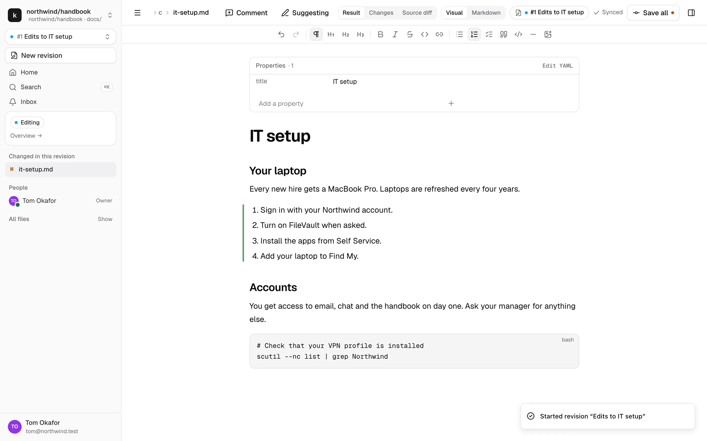
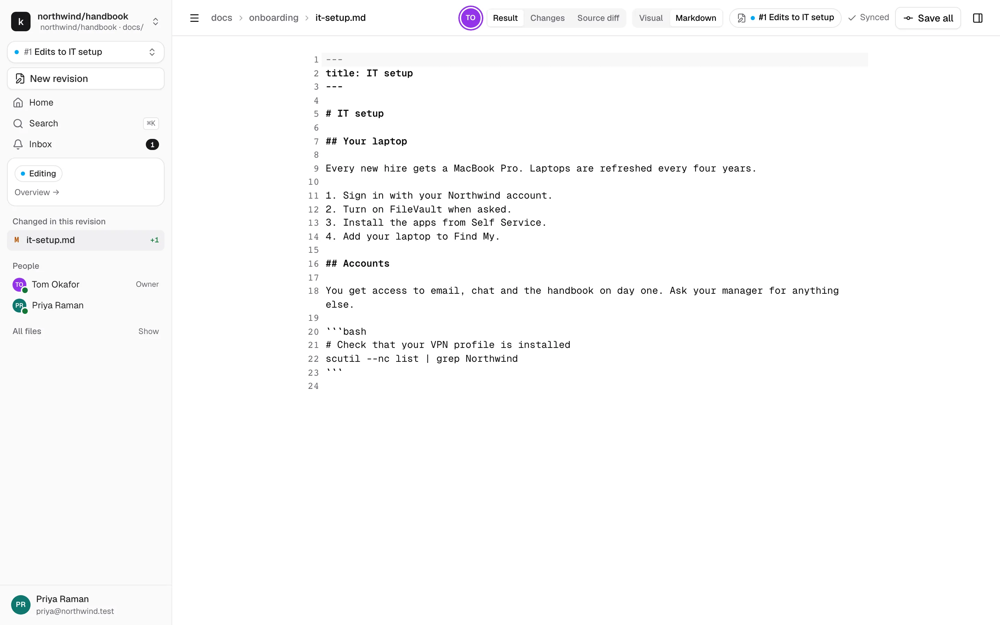
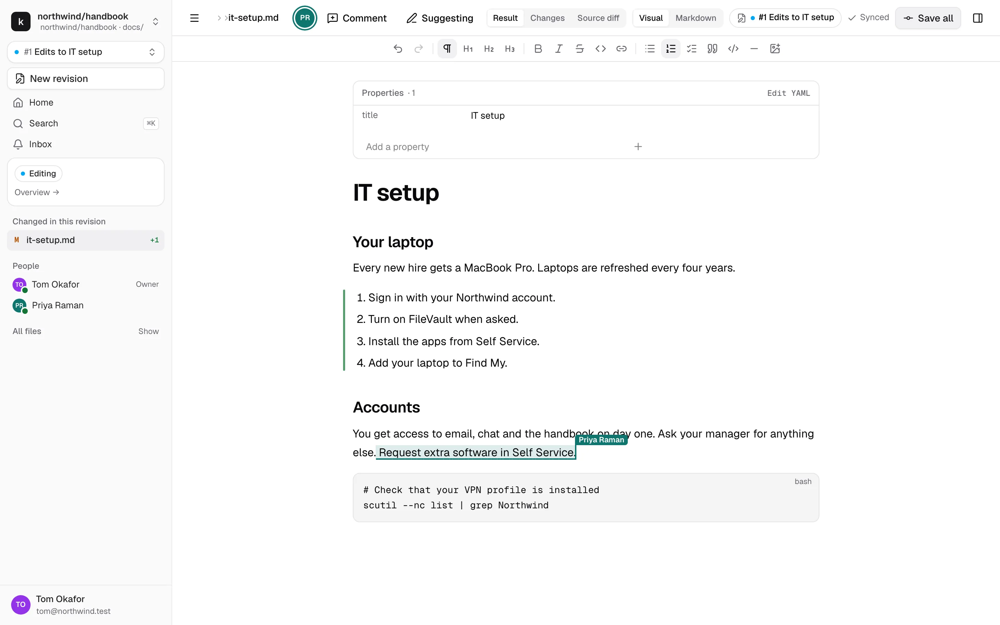
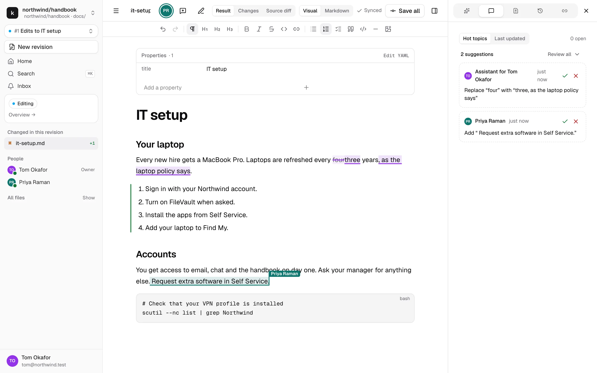
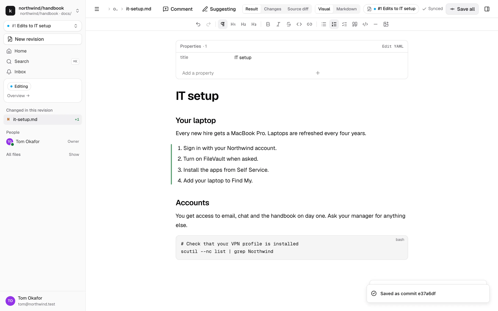
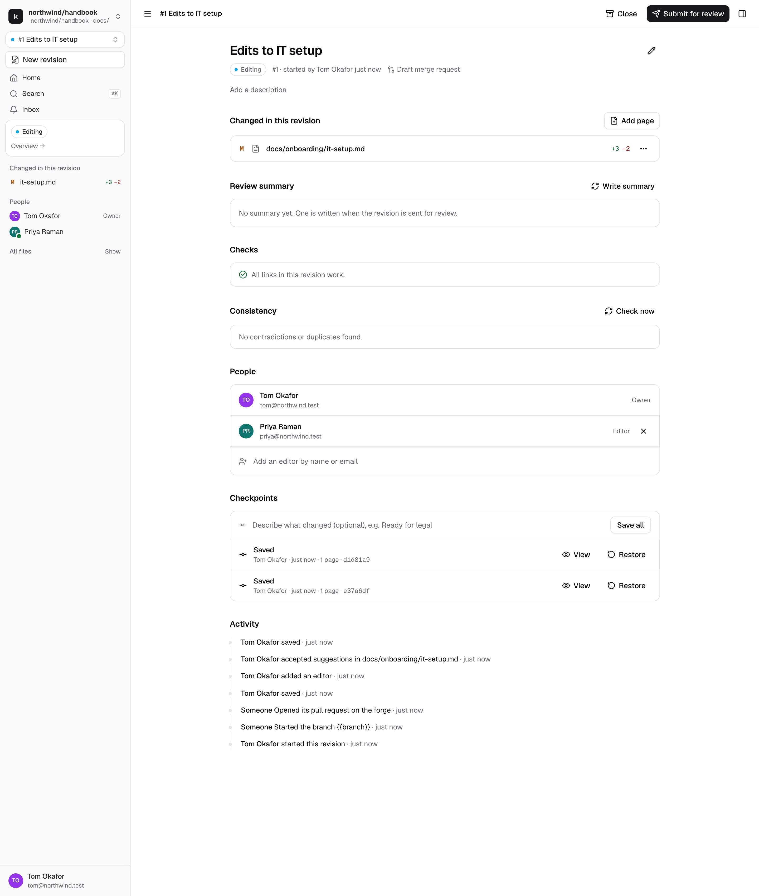
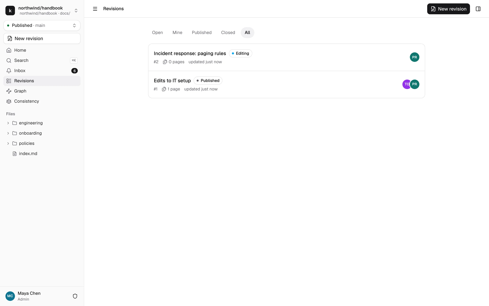

# Edit pages in a revision

Published pages are read-only. To change something, you work in a **revision**: a named set of changes to one or more pages. Nobody else sees your changes on Published until a reviewer approves the revision and a maintainer publishes it. Anyone in the repository can open your revision and follow along, though.

You need the Contributor role or above to start a revision.

## Start a revision

There are three ways:

- **Edit a page.** Open the page and click **Edit** in the top bar. kmdn starts a revision named "Edits to <page title>", opens the page in it and says so in a toast. Rename it from its overview whenever you like.
- **New revision.** The button at the top of the sidebar asks for a title and an optional description, and creates an empty revision. Open any page and start typing, or add a new page.
- **Ask the assistant.** Describe the change in the box on the repository home. The assistant proposes a revision with the pages it plans to touch, and you confirm. See [The assistant](assistant.md).

Once you're in a revision, the revision picker at the top of the sidebar shows its name, and the sidebar changes:

- A status pill, like **Editing**, and a link to the revision's overview.
- **Changed in this revision**: the pages it touches, with line counts. M marks a modified page, A an added one, D a deleted one and R a renamed one.
- **People**: its editors and reviewers, with a green dot for those online.
- **All files**, collapsed. Opening a page you haven't changed shows its Published content, and your first edit adds it to the revision.

Switch between Published and your revisions with the picker. Switching never loses work.

## Write

The editor works like a word processor. The toolbar has headings, bold, italic, strikethrough, code, links, bulleted, numbered and check lists, quotes, code blocks, dividers and images. Markdown shortcuts work too: `## ` makes a heading, `- ` a list, `**bold**` bold.

**Properties.** The front matter at the top of the file, like `title` or `owner`, shows as a properties table. Edit values in place, add a property at the bottom, or click **Edit YAML** to edit it as text.

**Markdown kept as written.** kmdn doesn't rewrite what it doesn't understand. Raw HTML, callouts, shortcodes and other syntax the visual editor doesn't handle show as a block you can edit as source. Parts of the page you don't touch keep their exact bytes, so reviewers only see what you changed.

**Images.** Drag an image into the page, paste it, or use the image button. kmdn uploads it into the revision, by default into an `images/` folder next to the page. The repository's `.kmdn.yml` can choose another place. Images are committed with the revision.

**Big pages.** Pages over 1 MB open in the markdown editor only.

## Markdown mode

Switch between **Visual** and **Markdown** in the editor bar. Markdown mode shows the file's source with line numbers, and both views stay in sync, including other people's live edits and cursors.

While a page has pending suggestions, its markdown is locked. Accept or reject them in the visual editor first.

## Work together

Everyone who can edit the revision edits at the same time. You see their cursors with their names, and their changes as they type. The editor shows **Synced** while your edits reach everyone.

To add someone as an editor, open the revision's overview and type their name or email in **People**. They must be a Contributor or above in the repository. People who can't edit the revision can still read it and comment.

If your connection drops, the editor says **Offline, reconnecting…** and keeps your changes in the tab. They sync when the connection is back. Nothing is stored on your device, so don't close the tab while it's offline.

## Suggest instead of changing

Turn on **Suggesting** in the editor bar to propose changes instead of making them. Your insertions show underlined in your color, your deletions struck through. Anyone who can edit the revision accepts or rejects them.

The Comments tab lists pending suggestions with the comment threads. Accept or reject one at a time, or use **Review all** to accept or reject everything, or everything from one person. Every suggestion can have a thread, so you can discuss it before deciding.

A revision can't be published while suggestions are pending.

## Comment

Select text and click **Comment** in the editor bar. Threads show in the Comments tab, sorted by **Hot topics**, the most active first, or by **Last updated**. Reply, react, resolve, or mention someone with `@`. If the text a thread points to is deleted, the thread moves to the top as detached, with the original quote.

## Add, rename and delete pages

- **Add page**, on the overview, creates a page at the path you choose, blank or from one of the repository's templates.
- **Rename or move**, in a page's menu on the overview, changes its path. kmdn finds the pages that link to it and offers to update those links in the same revision.
- **Delete page** removes it when the revision is published. For a page the revision added, the action is **Discard new page**.

The overview's **Checks** section lists broken links: links to pages or headings that don't exist, and links to pages this revision removes.

## Save all and checkpoints

Your edits reach your collaborators live, but they're not saved to the repository yet. The top bar shows **Unsaved changes** until someone clicks **Save all**.

**Save all** saves the revision's current state as a checkpoint, credited to you. Anyone can click it, and each click by a different person is credited to that person. When nothing changed since the last save, it says **All changes saved**.

kmdn also saves before submitting for review, applying updates from Published, restoring a checkpoint and publishing.

The overview lists the checkpoints, newest first, with who saved them. **View** shows the revision's pages as they were then. **Restore** brings that content back as new changes, which the next Save all saves. It never erases later checkpoints.

Under the hood, a checkpoint is a commit on the revision's branch. [How kmdn uses git](../reference/git.md) explains the details, for the curious.

## The revision overview

Click **Overview** in the sidebar, or the revision's name anywhere, to open its overview:

- Title, description, state, who started it, and a link to its pull request on GitHub or GitLab
- The changed pages
- The review summary, written by the assistant once the revision is sent for review
- Checks: broken links, conflicts with Published
- Consistency: contradictions and duplicates the revision introduces
- Reviewers and their approvals
- People
- Checkpoints
- Activity: everything that happened, newest first

## Find revisions

**Revisions** in the sidebar lists the repository's revisions. Filter by Open, Mine, Published, Closed or All.

## Close a revision

**Close**, on the overview, abandons a revision. Its editors and maintainers can close it, and reopen it within 90 days. A closed revision is read-only, and nothing in it is published.

## Next

When the revision is ready, [submit it for review](review-and-publish.md).
