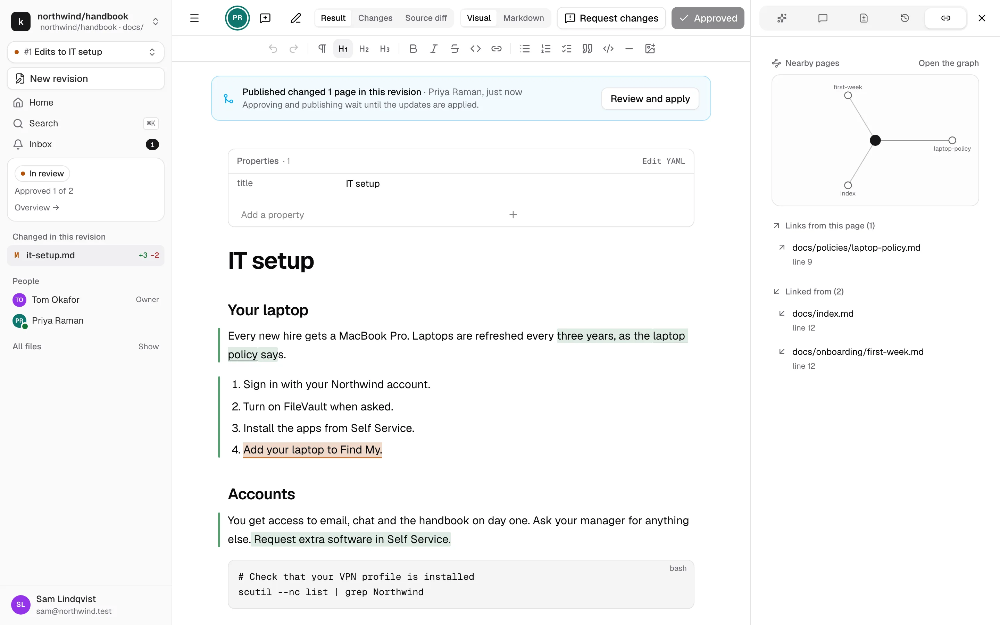
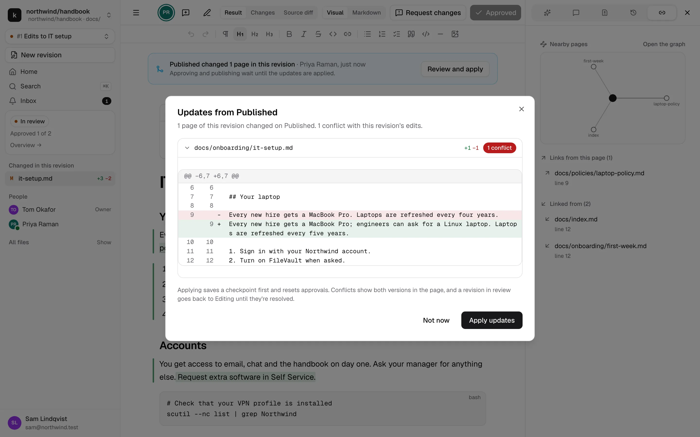
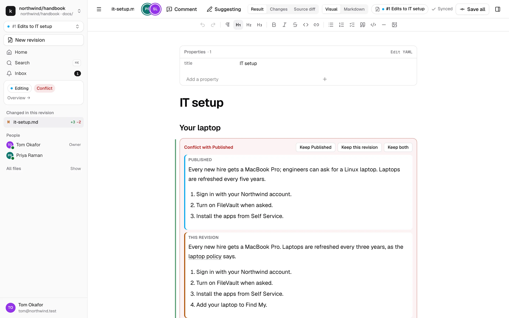

# Updates from Published and conflicts

A revision starts from Published as it was at that moment. Published can move on while you work: another revision gets published, or an engineer pushes straight to the repository. kmdn brings those changes into your revision, but only after a person has looked at them.

## When nothing overlaps

If the new Published changes touch pages your revision doesn't change, kmdn moves your revision onto the new Published silently. Pages you haven't touched always show their latest Published content anyway.

## When your pages changed

If Published changed a page your revision also changes, a banner appears at the top of the revision:

While the update waits, approving and publishing are blocked. Editing and commenting carry on as usual. The people who can apply it get an inbox item:

- While the revision is in **Editing**, any of its editors.
- While it's **In review** or **Approved**, any assigned reviewer.

## Preview and apply

Click **Review and apply**. kmdn shows what changed on Published, page by page: which pages merge cleanly and which have conflicts with the revision's own edits.

**Not now** closes the preview. The banner and the block on approving and publishing stay until someone applies the update.

Click **Apply updates**. kmdn saves the revision first, then merges:

- Changes that don't overlap with yours go straight in. kmdn merges by paragraph, list item and heading, so edits to neighbouring paragraphs don't conflict.
- Passages that both sides changed become conflict blocks in the page.
- Approvals reset, because the content changed.
- If there's a conflict and the revision was in review or approved, it goes back to **Editing** with a **Conflict** flag. Its editors and reviewers are told.

If Published moves again before anyone applies the update, kmdn recomputes it against the newest version. There's only ever one update to apply.

## Resolve a conflict

A conflict shows in the page as a card with both versions: **Published** on top, **This revision** below. Both are editable.

Pick one:

- **Keep Published** drops the revision's version of that passage.
- **Keep this revision** drops Published's.
- **Keep both** puts both one after the other, for you to merge by hand.

Any editor can resolve a conflict. Resolving is a direct edit, even with Suggesting on. To agree on a choice first, comment on the conflict like on any passage. After picking a version, you can still edit the result, for example to bring in the part of Published's change you want to keep.

When no conflict is left, the **Conflict** flag clears, and the activity says "All conflicts are resolved". An editor then clicks **Submit for review** again, and the same reviewers are asked.

## A page Published deleted

If Published deleted a page your revision changes, the page shows a banner instead of a conflict block:

- **Keep this revision's page** keeps it. Publishing adds it back.
- **Delete it too** removes it from the revision.

## Why kmdn doesn't apply updates by itself

Someone reviewed your revision against what Published said at that time. An automatic merge would change what they approved without anyone noticing. Previewing first, then resetting approvals, means reviewers always approve what will actually be published.
